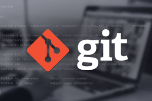
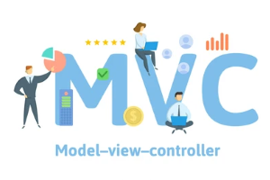
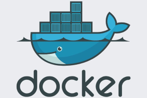

# Presentación de la Materia

---

## Temario

1. Aplicaciones web y arquitectura cliente servidor
2. Control de versiones (Git)
3. Introducción a Go
4. Funciones, variables y estructuras en Go
5. Manejo de errores en Go
6. Consumo de APIs en Go con HTTP
7. Testing en Go
8. Testing assertions

---

### Condiciones de Regularidad y Examen Final

- **Regularidad:** Para regularizar la materia se pide el desarrollo relacionado con la autenticación de usuarios, la visualización de la página de inicio con el listado de cursos, la búsqueda de cursos y la funcionalidad de inscripción.
- **Examen Final:** Para el examen final se solicita el desarrollo completo del sistema y puntos extras enumerados a continuación:
  - Gestión de cursos por parte de los administradores.
  - Seguridad del sistema en todos los componentes.
  - Funcionalidad de listado de cursos a los que está inscrito el usuario.
  - Implementar un sistema de comentarios y valoraciones para los cursos.
  - Permitir a los usuarios subir archivos relacionados con los cursos.
  - Dockerizar y componer la solución completa.

---

## ¿Dudas, Preguntas, Comentarios?

