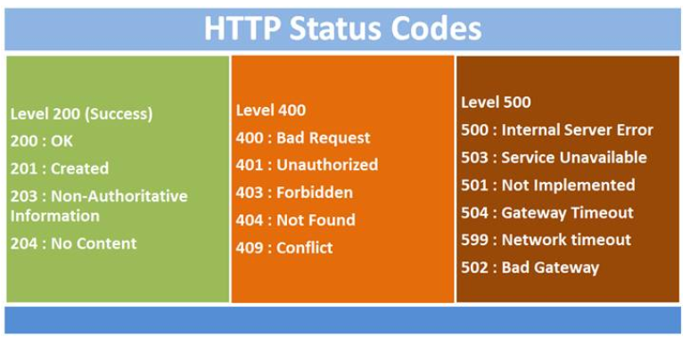

# Presentación de la Materia

---

## Temario

1. Aplicaciones web y arquitectura cliente servidor
2. Control de versiones (Git)
3. Introducción a Go
4. Funciones, variables y estructuras en Go
5. Manejo de errores en Go
6. Consumo de APIs en Go con HTTP
7. Testing en Go
8. Testing assertions

---

## Arquitetcura Cliente-Servidor


---

## Aplicaciones Web

<!-- .slide: style="font-size: 0.85em" -->

- Son herramientas a las que los usuarios pueden acceder a través de Internet.
- Son programas que se codifican en un lenguaje interpretable por el browser o navegador web.
- El esquema completo está conformado por:
  - Cliente
  - Servidor
  - Base de datos
    - Base de datos relacional
    - Caché
    - Motores de búsqueda
    - Etcétera

---

## Arquitectura cliente-servidor

En la arquitectura cliente servidor, uno o más servidores centralizan el conjunto de solicitudes (request) que los clientes envían.
Cada uno de los clientes recibe la respuesta (response) que el servidor retornó luego de realizar el procesamiento y la interpreta.

- Llamamos _client side_ al conjunto de clientes que interpreta la respuesta del servidor.
- Llamamos _server side_ al procesamiento de datos que se da del lado del server.

---

## Arquitectura cliente-servidor


---

En las aplicaciones web aparecen 2 conceptos fundamentales:

- Frontend
- Backend

---

## Frontend

- Es la capa de aplicación que se comunica con el cliente.
- Generalmente, implementa los aspectos visuales y de comportamiento de una aplicación.
- Puede tener código que se ejecute client side y server side.
- La ejecución es dependiente de la plataforma del cliente.

---

## Backend

- Es la capa de aplicación encargada de la lógica de negocio y conexión con servicios.
- Generalmente, implementa procesamiento sobre datos que el usuario no puede ver.
- El código se ejecuta server side.
- La ejecución no depende de la plataforma del cliente ya que se ejecuta en el servidor.

---

## Frontend y Backend


---

## REST - Transferencia de estado representacional

Es un estilo de arquitectura de software para sistemas hipermedia.
Es ampliamente usado en la programación de aplicaciones web descentralizadas.

---

## REST

- Comunicación basada en un protocolo cliente servidor sin estado.
- Conjunto de operaciones definidas:
  - **GET** Consulta
  - **POST** Creación
  - **PUT** Actualización
  - **DELETE** Borrado
- Sintaxis universal de direccionamiento.
- Códigos de estado para representar diferentes situaciones.

---

## REST



[Status Code](https://cheatography.com/kstep/cheat-sheets/http-status-codes/#google_vignette)

---

## API - Interfaz de Programación de Aplicaciones

<!-- .slide: style="font-size: 0.80em" -->

- Una API es una aplicación que se encarga de realizar algún procesamiento sobre algún dato de entrada para brindar un resultado.
- La ventaja de las API’s a diferencia de las aplicaciones monolíticas es que permiten ser consumidas por un cliente y también realizar peticiones a otras API’s.
- Es por esto que las API’s pueden ser entendidas como un conjunto de nodos que se interconectan para generar un procesamiento más complejo de los datos, de manera descentralizada.
- Cada API es responsable de su tarea particular.
- Las distintas API’s se comunican mediante el protocolo REST.
- [Referencia API’s de Mercado Libre](https://developers.mercadolibre.com.ar/)

---


---

### MVC - Modelo vista controlador

Es un patrón de arquitectura de software que separa la implementación de una API en 3 capas:

- Datos y lógica de negocio (frontend y backend).
- Módulo encargado de gestionar los eventos y comunicaciones con servicios (frontend y backend).
- Representación de los datos o vista (frontend).

---

### MVC


---

### Ejercicio JSON

**Diseñar un archivo JSON** (Javascript Object Notation) que contenga la información de una nota de pedido que hace una empresa a una compañía de transporte para una determinada dirección detallada y con un conjunto de ítems con precio a ser transportados. [https://api.mercadolibre.com/items/MLA1387074579](https://api.mercadolibre.com/items/MLA1387074579)

---

### Ejercicio JSON

<!-- .slide: style="font-size: 0.85em" -->

Tips cuando se elabora un JSON:

- Corroborar que el JSON sea válido.
- Indentar correctamente cada sección del JSON:
  - Un nuevo tab (o espacios) luego de cada llave abierta.
  - Un nuevo tab (o espacios) luego de cada corchete abierto.
  - Un espacio luego de cada 2 puntos y antes del valor.
  - Una nueva línea para cada campo.
- Usar el valor explícito sin comillas para los valores numéricos.
- Usar el valor explícito sin comillas para los valores booleanos.
- Usar siempre minúsculas y guiones bajos en las keys.
- Usar keys en inglés para evitar errores de caracteres especiales.

---

### Ejercicio JSON

```json
{
  "id": 1,
  "address": {
    "country": "Argentina",
    "city": "Cordoba",
    "zip_code": 5000,
    "street": "Av. Rafael Nuñez",
    "number": 4600
  },
  "items": [
    {
      "id": 513423,
      "title": "Zapatillas Adidas",
      "price": 25000,
      "has_taxes": false
    },
    {
      "id": 513424,
      "title": "Camiseta Nike",
      "price": 30000,
      "has_taxes": false
    }
  ],
  "total": 55000
}
```
