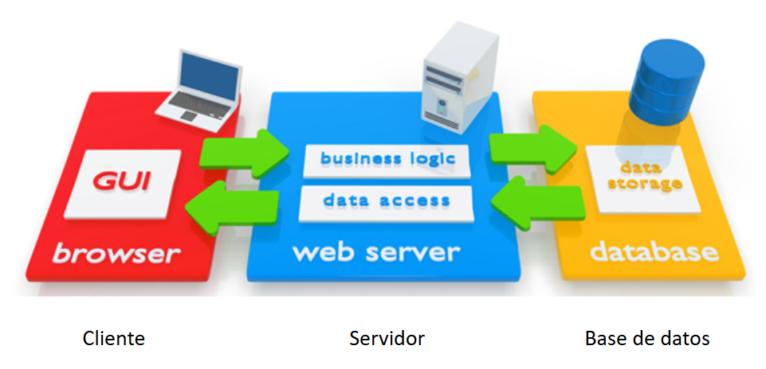
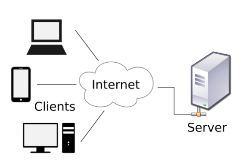
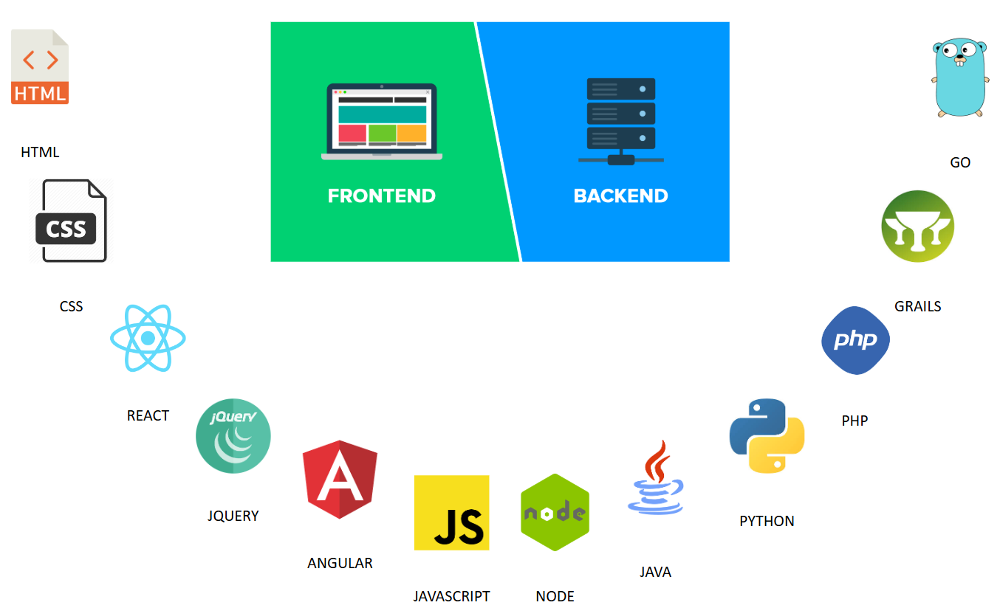

# Aplicaciones web y arquitectura cliente servidor

---

## Temario

1. Introducción a las aplicaciones web
2. Arquitectura cliente servidor
3. Frontend y backend
4. REST - Transferencia de estado representacional
5. API - Interfaces de programación de aplicaciones
6. MVC - Modelo vista controlador

---

## Arquitectura Cliente-Servidor



---

## Aplicaciones Web

<!-- .slide: style="font-size: 0.70em" -->

- Son sistemas con los que el usuario puede interactuar a través de Internet.
- Están compuestas por:
  - Cliente:
    - Browser, navegador web o aplicación móvil nativa.
    - Las mismas se conectan con los servicios del backend.
  - Servidor:
    - Servicio de backend que procesa las solicitudes
    - Múltiples microservicios que procesan la información
  - Fuente de datos
    - Bases de datos relacionales
    - Bases de datos no relacionales
    - Servicios de Caché
    - Motores de búsqueda
    - Modelos de Inteligencia Artificial
    - Servicios externos

---

## Arquitectura cliente-servidor

<!-- .slide: style="font-size: 0.70em" -->

En la arquitectura cliente servidor, uno o más servidores centralizan el conjunto de solicitudes (request) que los clientes envían.
Cada uno de los clientes recibe la respuesta (response) que el servidor retornó luego de realizar el procesamiento y la interpreta.

- Llamamos _client side_ al conjunto de clientes que interpreta la respuesta del servidor.
- Llamamos _server side_ al procesamiento de datos que se da del lado del server.



---

## Frontend & Backend

<!-- .slide: style="font-size: 0.80em" -->

- **Frontend**
  - Es la capa de aplicación que se comunica con el cliente.
  - Generalmente, implementa los aspectos visuales y de comportamiento de una aplicación.
  - Puede tener código que se ejecute client side y server side.
  - La ejecución es dependiente de la plataforma del cliente.
- **Backend**
  - Es la capa de aplicación encargada de la lógica de negocio y conexión con servicios.
  - Generalmente, implementa procesamiento sobre datos que el usuario no puede ver.
  - El código se ejecuta server side.
  - La ejecución no depende de la plataforma del cliente ya que se ejecuta en el servidor.

---

## Frontend y Backend



---

### HTTP - Protocolo

<!-- .slide: style="font-size: 0.80em" -->

Es un **protocolo** que define cómo se comunican los clientes y servidores en la web.

- HTTP especifica varios métodos, los que más vamos a utilizar son:
  - **GET** (obtener datos)
  - **POST** (enviar datos)
  - **PUT** (actualizar datos)
  - **DELETE** (eliminar datos)
- HTTP es solo el canal de transporte, no define cómo deben estructurarse los datos ni cómo organizarlos.
- HTTP utiliza los siguientes códigos:
  - **2xx** = Operaciones exitosas
  - **4xx** = Errores del cliente
  - **5xx** = Errores del servidor

---

## REST


[Lista completa de los códigos de estado HTTP](https://cheatography.com/kstep/cheat-sheets/http-status-codes/)

---

## REST - Transferencia de estado representacional

<!-- .slide: style="font-size: 0.65em" -->

Es un **conjunto de principios** para diseñar APIs que sean simples, escalables y eficientes.

**REST** se apoya en HTTP y establece reglas como:

- Uso de recursos con URLs claras. Por ejemplo /users, /products/123.
- Uso adecuado de métodos HTTP. Por ejemplo GET para leer, POST para crear, etc.
- Respuestas en formatos estándar como JSON o XML.
- Stateless: cada petición es independiente y no mantiene estado en el servidor.

Ejemplo de API REST sobre HTTP:

- **GET** https://api.tienda.com/products/617349 → Devuelve el producto con ID = 617349.
- **POST** https://api.tienda.com/products → Crea un nuevo producto.

REST no está ligado exclusivamente a HTTP; puede implementarse sobre otros protocolos como WebSockets o gRPC, aunque HTTP es el más común.

---

### Ejercicio 1: Analizando un servicio

<!-- .slide: style="font-size: 0.65em" -->

1. En un navegador abrir las **DevTools** o **Herramientas de Desarrollo** presionando **F12**.
2. Navegar a [https://tienda.claro.com.ar](https://tienda.claro.com.ar)
3. En la pestaña de **Network** o **Red** analizar las siguientes peticiones:
    - contentManagement?content=Productos_destacados_spot
    - contentManagement?content=Footer_Content&page=home
4. De la petición debe obtener:
    - Método
    - Dirección url
    - Cabecera
    - Cuerpo
5. De la respuesta debe obtener:
    - Código de estado
    - Mensaje de estado
    - Cabeceras
    - Cuerpos

---

### Ejercicio 2: Usando Swagger

1. Acceda al siguiente swagger: [https://petstore.swagger.io/](https://petstore.swagger.io/)
2. Verifique el funcionamiento de los siguientes métodos HTTP buscando obtener diferentes respuestas (200, 404) empleando diferentes parámetros de entrada: 
    - **GET** /pet/{petId}
    - **DELETE** /pet/{petId}
    - **POST** /pet/{petId}

---

### Ejercicio 3: Usando Postman (parte 1)

Las mismas peticiones que antes realizó empleando Swagger, realizarlas empleando postman:

1. Cree una colección que se llame **petStore**
2. Copiar de [https://petstore.swagger.io/](https://petstore.swagger.io/) la información de la petición HTTP e importarlo.

---

### Ejercicio 3: Usando Postman (parte 2)

Las mismas peticiones que observó en la Tienda del ejercicio 1, realizarlas empleando postman:
1. Cree una colección que se llame **Claro**
2. En el navegador, en la pestaña de network hacer click en los servicios de productos destacados o del footer. Click cn copy > copy curl as curl (bash)
3. En postman click en “Import”
4. Pegar la información copiada y click en “Import into collection”

---

### Ejercicio 4: Diseñar un JSON

**Diseñar un archivo JSON** (Javascript Object Notation) que contenga la información de una nota de pedido que hace una empresa a una compañía de transporte para una determinada dirección detallada y con un conjunto de ítems con precio a ser transportados.

---

### Ejercicio 4: Diseñar un JSON

<!-- .slide: style="font-size: 0.85em" -->

Tips cuando se elabora un JSON:

- Corroborar que el JSON sea válido.
- Indentar correctamente cada sección del JSON:
  - Un nuevo tab (o espacios) luego de cada llave abierta.
  - Un nuevo tab (o espacios) luego de cada corchete abierto.
  - Un espacio luego de cada 2 puntos y antes del valor.
  - Una nueva línea para cada campo.
- Usar el valor explícito sin comillas para los valores numéricos.
- Usar el valor explícito sin comillas para los valores booleanos.
- Usar siempre minúsculas y guiones bajos en las keys.
- Usar keys en inglés para evitar errores de caracteres especiales.

---

### Ejercicio 4: Diseñar un JSON

```json []
{
  "id": 1,
  "address": {
    "country": "Argentina",
    "city": "Cordoba",
    "zip_code": 5000,
    "street": "Av. Rafael Nuñez",
    "number": 4600
  },
  "items": [
    {
      "id": 513423,
      "title": "Zapatillas Adidas",
      "price": 25000,
      "has_taxes": false
    },
    {
      "id": 513424,
      "title": "Camiseta Nike",
      "price": 30000,
      "has_taxes": false
    }
  ],
  "total": 55000
}
```

---

## ¿Dudas, Preguntas, Comentarios?


