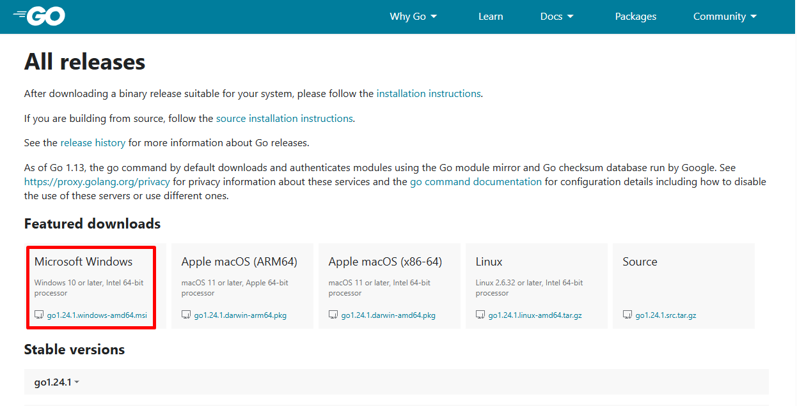
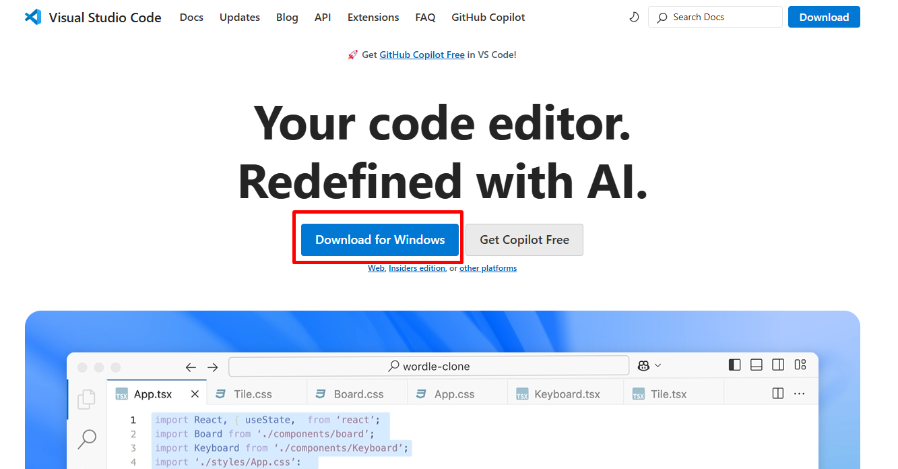
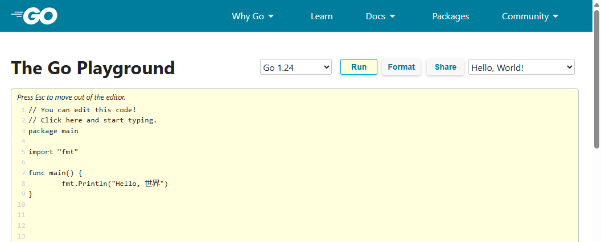
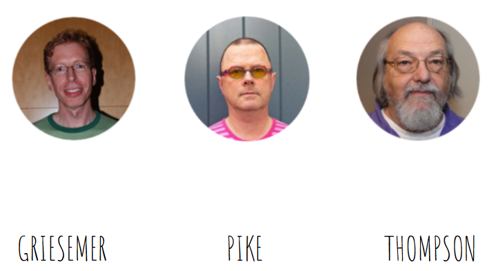
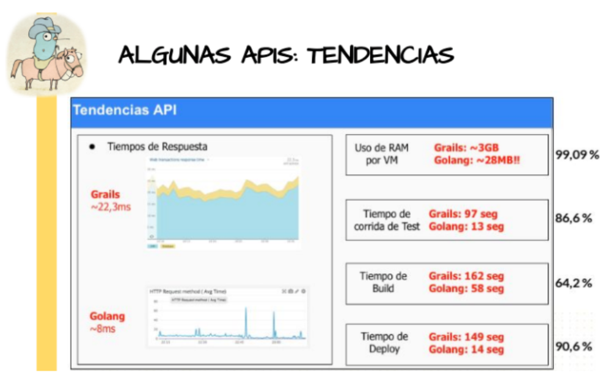
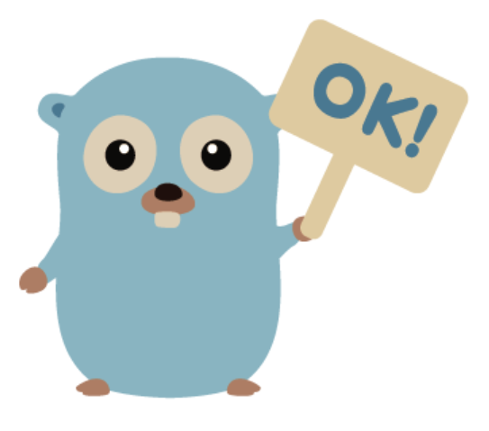
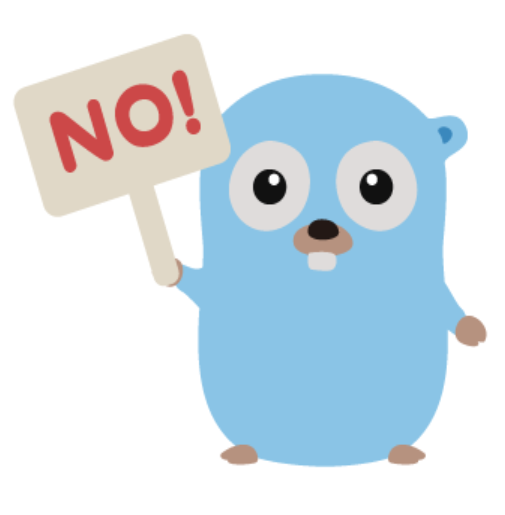
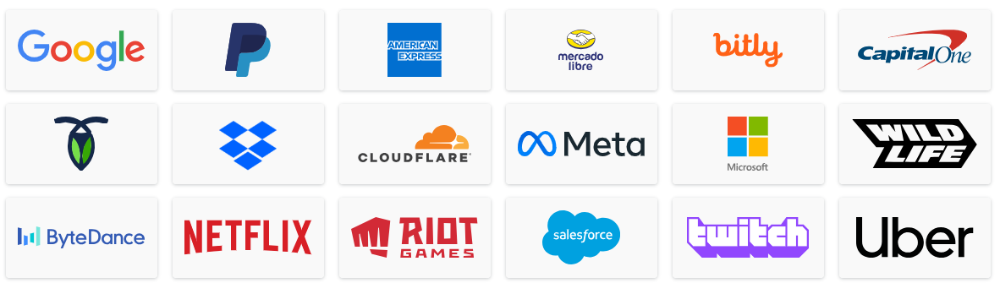
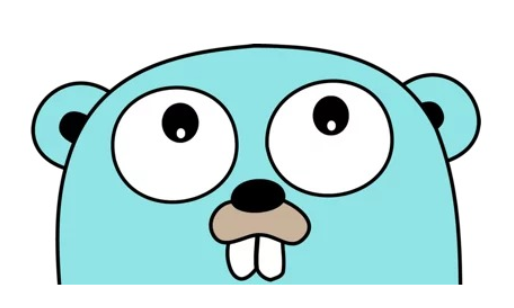

<section data-background-image="images/go/background.jpeg">

<br><br><br><br><br><br><br><br>

<h1> Introducción a GO </h1>

</section>

---

<style> 
h1 {
  background-color: rgba(255,255,255,.7);
}

.small{
	font-size: 0.5em
}

.grid-container2 { 
  display: grid; 
  grid-template-columns: auto auto; 
  font-size: 0.8em; 
  text-align: left !important; 
} 

.grid-item { 
  border: 3px solid rgba(121, 177, 217, 0.8); 
  padding: 20px; 
  text-align: left !important; 
  } 
</style>

## Temario

<div class="grid-container2">
<div class="grid-item">

- Instalar Go
- Instalar VSC
- Configuración de VSC
- Playground
- Links para comenzar en Go
- ¿Qué es Go?
- ¿Cuáles son sus características?
- Lenguaje Go
- ¿Por qué usar Go?
- ¿Cuáles son sus ventajas y desventajas?

</div>
<div class="grid-item">

- Empresas que usan Go
- Hola mundo!
- Declaración de Paquetes
- Importanción de Paquetes
- Paquetes Estándar
- Organización de Paquetes
- Paquetes Personalizados
- Espacio de trabajo
- Ejercicio Hola Mundo!
- Visibilidad de Símbolos

</div></div>

---

### Instalar go

1. Ir a https://go.dev
2. Click en **Download**
3. En la sección **Featured downloads** seleccionar uno acorde al SO. (pasos detallados de instalación en [https://go.dev/doc/install](https://go.dev/doc/install))
4. Una vez completado el proceso de intalación, para verificar que se realizó correctamente, abrir la terminal y ejecutar

```bash
go version
```

---

### Instalar go



---

### Instalar VSC

1. Ingresar a [https://code.visualstudio.com/](https://code.visualstudio.com/)
2. Click "Download".
3. Seguir los pasos de instalaicón.



---

### Configuración de VSC

1. Presionar en el menú izquierdo "Extensiones"
2. Buscar **Go** e instalarla
3. Hacer click en Manage (engranaje abajo a la izquierda)
4. Click en "Settings"
5. Buscar "Save" y clickear el checkbox **Format on Save**

---

### Playground de Go

Esta herramienta permite probar código sencillo sin tener instalado un IDE de desarrollo. El [playground de Go](https://go.dev/play/) está disponible en su página.



---

## Links para comenzar en Go

- [Go](https://go.dev/)
- [Go Tour](https://goo.gl/rGzKJj)
- [Go by Example](https://gobyexample.com/)
- [Gopher's Reading List](https://goo.gl/PG5KU8)

---

## ¿Qué es Go?

Go se originó (2007/09) como un experimento para diseñar un nuevo lenguaje de programación que resolvería las críticas comunes a otros lenguajes manteniendo sus características.



---

## ¿Cuáles son sus características?

<!--  -->

- De código abierto
- Compilado
- Tipado estático
- Multiplataforma y multiparadigma (orientado a objetos, funcional y estructurada)
- Garbage collection
- Administración segura de la memoria
- Manejo de Concurrencia
- Paralelismo
- Velocidad
- Gran biblioteca estándar

---

## Lenguaje de Go

- Hereda aspectos de C (punteros)
- Comparte similitudes con Java, Python y otros
- Características de otros lenguajes de programación
- Algunas características de POO

---

## ¿Por qué usar Go?



---

<section>

## Principales ventajas

- Sintaxis parecida a lenguajes dinámicos
- Inferencia de tipos (aún con tipado estático)
- Rápida compilación y ejecución de test
- Manejo de paquetes remotos
- Go routines, canales y select
- Implementación de interfaces
- Compilación a binarios nativos



</section>

---

<section>

## Principales desventajas

- Requiere manejo correcto de punteros
- Expresiones no compactas
- Inflexible
- No para cualquier tipo de aplicación
- Poca comunidad (cada vez más)
- Peligro de mala implementación



</section>

---

## Empresas que usan Go



---

## Hola Mundo

```go []
package main
import "fmt"
func main() {
	fmt.Println("Hola mundo")
}
```



---

## Declaración de paquetes

- Cada archivo fuente Go comienza con una declaración de paquete en la parte superior del archivo.
- La declaración de paquete especifica a qué paquete pertenece el archivo.
- La declaración de paquete se realiza mediante la palabra clave package, seguida del nombre del paquete.

```go
package main //Ejemplo de declaración de paquete
```

---

## Importación de paquetes:

- Los paquetes se importan para que sus funcionalidades estén disponibles en el archivo de código actual.
- La importación de paquetes se realiza mediante la palabra clave import, seguida del nombre del paquete.

```go
import (
	"fmt"
	"math"
) //Ejemplo de importación de paquetes
```

---

## Paquetes estándar:

- Go proporciona una amplia biblioteca estándar que incluye muchos paquetes predefinidos para realizar tareas comunes.
- Estos paquetes se pueden importar y utilizar en cualquier programa Go sin necesidad de instalarlos por separado.

[Go Package](https://pkg.go.dev/)

---

## Paquetes personalizados:

- Además de los paquetes estándar, puedes crear tus propios paquetes personalizados.
- Agrupa la funcionalidad relacionada en un paquete y reutiliza este paquete en diferentes partes de tu aplicación o en diferentes proyectos.

---

## Organización de paquetes:

- Los paquetes en Go están organizados en una estructura de directorios.
- La convención común es que el nombre del paquete sea el último segmento del nombre del directorio que contiene el archivo fuente.

```bash
/src
  /myproject
    main.go
    /util
      helper.go
```

---

## Go env

Es una herramienta muy útil para ver y configurar variables de entorno que Go usa para compilar, ejecutar y gestionar dependencias.

```bash
go env
```

- Muestra las variables de entorno que Go usa internamente.
- Ayuda a entender cómo está configurado el entorno de desarrollo Go.
- Es útil para depurar problemas con rutas, compilación cruzada, proxies, etc.

---

### GOPATH

Antes de Go 1.11, todos los proyectos de Go tenían que estar dentro del **GOPATH**.

Esto permitía al compilador y herramientas de Go encontrar el código fuente y sus dependencias.

### GOROOT

GOROOT es donde está instalado el compilador de Go y sus herramientas estándar.

Contiene el código fuente del runtime de Go y las librerías estándar, como fmt, net/http, etc.

---

### Ejercicio 1: Hola Mundo!

<!-- .slide: style="font-size: 0.80em" -->

1. Crear repositorio para los ejercicios de **Arqui de Soft 1**.
2. Crear subcarpeta para **ejercicio 1**.
3. Crear un archivo **hola.go**
4. Agregar el código:

```go []
package main

import "fmt" //Se importa automáticamente

func main() {
	fmt.Println("Hola Mundo!")
}
```

5. En la terminal escribir `go run hola.go`
6. Si queremos compilar `go build hola.go`

Nota: Si VSC sugiere agregar herramientas, presionar SI

---

### Ejercicio 1: Hola Mundo!

<p class="small">(para ver en casa y repasar)</p>

<iframe width="560" height="315" src="https://www.youtube.com/embed/uLjrm9bRJ-c?si=fWbBL8-CGZ84thw7" title="YouTube video player" frameborder="0" allow="accelerometer; autoplay; clipboard-write; encrypted-media; gyroscope; picture-in-picture; web-share" referrerpolicy="strict-origin-when-cross-origin" allowfullscreen></iframe>

---

## Visibilidad de símbolos:

- En Go, la visibilidad de un símbolo (función, tipo, variable) fuera de un paquete está determinada por si su nombre comienza con una letra **mayúscula** o **minúscula**.
- Los símbolos que comienzan con una letra **mayúscula** son visibles fuera del paquete (exportados), mientras que los símbolos que comienzan con una letra **minúscula** son visibles sólo dentro del paquete (no exportados).

---

## ¿Dudas, Preguntas, Comentarios?


