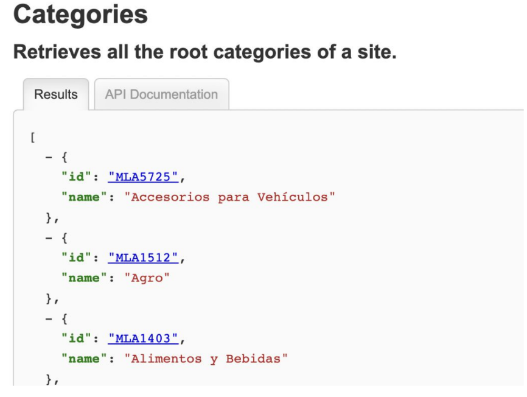

# Testing Assertions en GO

---

## Temario

---

## Testify y los asserts

[https://pkg.go.dev/github.com/stretchr/testify/assert](https://pkg.go.dev/github.com/stretchr/testify/assert)

```go
import (
    "testing"
    "github.com/stretchr/testify/assert"
)

func TestSomething(t *testing.T) {
    // assert equality
    assert.Equal(t, 123, 123, "they should be equal")

    // assert inequality
    assert.NotEqual(t, 123, 456, "they should not be equal")

    // assert for nil (good for errors)
    assert.Nil(t, object)

    // assert for not nil (good when you expect something)
    if assert.NotNil(t, object) {
        // now we know that object isn't nil, we are safe to make
        // further assertions without causing any errors
        assert.Equal(t, "Something", object.Value)
    }
}
```

---

## Ejemplo:

<!-- .slide: style="font-size: 0.60em" -->

**main.go**

```go
package main

import "fmt"

func Hello() string {
    return "Hello, world."
}

func main() {
    fmt.Println(Hello())
}
```

**test_main.go**

```go
package main

import (
    "testing"
    "github.com/stretchr/testify/assert"
)

func TestHello(t *testing.T) {
    assert.Equal(t, "Hello, world.", Hello())
}
```

```bash
go mod init test
go mod tidy
go test
```

---

## Ejercicio 1:

Escriba la función que pase estos tests. Ejecutar el test para comprobarlo.

```go
package main

import (
    "testing"
    "github.com/stretchr/testify/assert"
)

func TestCalculate(t *testing.T) {
    assert := assert.New(t)

    var tests = []struct {
        input    int
        expected int
    }{
        {2, 4},
        {-1, 1},
        {0, 2},
        {-5, -3},
        {99999, 100001},
    }

    for _, test := range tests {
        assert.Equal(Calculate(test.input), test.expected)
    }
}
```

---

## Ejercicio 2:

Escriba un test para la siguiente función

```go
func division(a int, b int) (int, error) {
	if b == 0 {
		return 0, errors.New(“no puedo dividir por 0”)}
	}
	return a / b, nil
}
```

---

## Ejercicio 3:

Escriba dos test, uno para comprobar la estructura de parsing y otro para la respuesta a un get de
la api:

[https://api.mercadolibre.com/sites/MLA/categories](https://api.mercadolibre.com/sites/MLA/categories)



---

## Que es el Package

Estructuras Logicas/Fisicas de organizar la distribución de carpetas y
componentes del software.

main.go -> package main

package_a - utils_a.go -> package package_a

package_b - utils_b.go -> package package_b

---

## Que es el Package

**utils_a.go**

```go
package package_a

func Hello() string {
    return "Hello, world."
}
```

**utils_b.go**

```go
package package_b

func Hello() string {
    return "Hello, main b."
}
```

---

## Que es el Package

<!-- .slide: style="font-size: 0.80em" -->

**main.go**

```go
package main

import "ucc/package_a"
import "ucc_package_b"
import "fmt"

func main() {
    fmt.Println(package_a.Hello)
	fmt.Println(package_b.Hello)
}
```

Por que ucc?

```bash
go mod init ucc
go mod tidy
go test ./...
go run main.go
```

---

## Ejercicio

Escribe los tests para los utils en los packages.

Ayuda:

- utils_a_test.go
- utils_b_test.go

---

## ¿Dudas, Preguntas, Comentarios?


