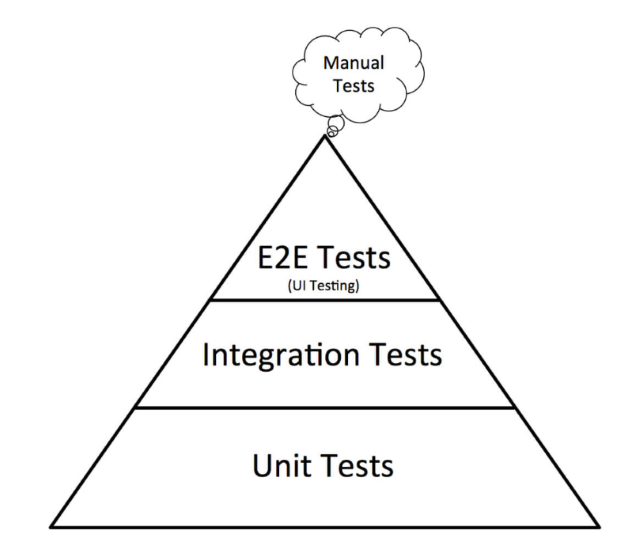

<style>
h1 {
  background-color: rgba(255,255,255,.7);
}

.small{
	font-size: 0.2em
}
</style>

<section data-background-image="images/go/background.jpeg">

<br><br><br><br><br><br>

<h1>Testing en GO</h1>

</section>

---

## Temario

1. Concepto y utilidad del testing o pruebas de software
2. Tipos de testing
   - Por scope
   - Por visibilidad
3. Cómo implementar testing en Go
   - Librería testing
   - Librería assert
4. Cobertura

---

## Concepto y utilidad de testing o pruebas de software

<!-- .slide: style="font-size: 0.80em" -->

- Las pruebas de software (en inglés software testing) son las investigaciones empíricas y técnicas cuyo objetivo es proporcionar información objetiva e independiente sobre la calidad del producto a la parte interesada o stakeholder. Es una actividad más en el proceso de control de calidad.
- El testing se puede realizar mediante pruebas estáticas (no requiere ejecución del software) y pruebas dinámicas (requieren ejecución del programa implementado).
- Librería para Golang: [https://github.com/stretchr/testify](https://github.com/stretchr/testify)

---

## Testing en Go

Los diferentes tipos de pruebas en software son:

- Pruebas unitarias
- Pruebas de integración
- Pruebas funcionales
- Pruebas e2e

---

## Pruebas Unitarias

Una prueba unitaria es una forma de comprobar el correcto funcionamiento de una unidad de código.

```go []
func division(a int, b int) (int, error) {
	if b == 0 {
      return 0, errors.New("no puedo dividir por 0")}
	}
	return a / b, nil
}
```

Ejemplo de test unitario:
```go []
func TestDivision(t *testing.T) {
    resultado := division(8, 4)

    assert.Equal(t, resultado, 2)
}
```

---

## Pruebas Funcionales

Una prueba funcional implica la ejecución de un servicio que está conectado con un conjunto de componentes externos.

```go []
func getUsuario(idUsuario int) *Usuario {
	if idUsuario == 0 {
      return nil
	}
	call := rest_client.Get("api.mercadolibre/usuarios")
	// ...
}
```

---

## Pruebas de Integración

Un test de integración hace referencia a una prueba de software donde se brindan un conjunto de entradas y se espera una salida sin conocer el proceso que ocurre internamente.

Las pruebas de integración son esenciales en Go porque permiten comprobar cómo funcionan juntos los distintos componentes o módulos de una aplicación, garantizando que la funcionalidad general del software siga siendo fiable y esté libre de errores.

[https://api.mercadolibre.com/users/1234567](https://api.mercadolibre.com/users/1234567)

---

## Pirámide de Pruebas



---

## Caja Blanca y Caja Negra

<!-- .slide: style="font-size: 0.80em" -->

- **Test de caja blanca:** Las pruebas de caja blanca (también conocidas como pruebas de caja de cristal o pruebas estructurales) se centran en los detalles procedimentales del software, por lo que su diseño está fuertemente ligado al código fuente.

- **Test de caja negra:** En teoría de sistemas y física, se denomina Caja Negra a aquel elemento que es estudiado desde el punto de vista de las entradas que recibe y las salidas o respuestas que produce, sin tener en cuenta su funcionamiento interno. En otras palabras, de una caja negra nos interesará su forma de interactuar con el medio que le rodea (en ocasiones, otros elementos que también podrían ser cajas negras) entendiendo qué es lo que hace, pero sin dar importancia a cómo lo hace.

---

## Cómo implementar testing en Go

<!-- .slide: style="font-size: 0.75em" -->

- En Go se recomienda definir los casos de prueba respecto de las condiciones que no queremos que ocurran en la ejecución de un módulo de software.
- En aquellos casos donde se busque verificar la consistencia de un valor esperado con una respuesta se puede utilizar una librería externa que permita validar los assert.
- Los tests de caja blanca pueden implementarse en cada uno de los paquetes que contienen los módulos de software a testear. Tienen que ver con funciones, variables, constantes y estructuras privadas.
- Los tests de caja negra pueden implementarse en la carpeta test y tienen que ver con funciones, variables, constantes y estructuras públicas.
- También se pueden implementar benchmarks para medir rendimiento.

---

## Cobertura

<!-- .slide: style="font-size: 0.90em" -->

- La cobertura de código es una medida (porcentual) en las pruebas de software que mide el grado en que el código fuente de un programa ha sido comprobado.
- Sirve para determinar la calidad del test que se lleve a cabo y para determinar las partes críticas del código que no han sido comprobadas y las partes que ya lo fueron, además se puede utilizar como técnica de optimización dentro de un compilador optimizador para llevar a cabo una eliminación de código muerto, más específicamente sirve para detectar código inalcanzable.​

---

### Package testing

El paquete [testing](https://pkg.go.dev/testing) es el framework de pruebas integrado en Go.
Se usa para escribir y ejecutar tests unitarios y ejemplos.

---

### Package testing: Comandos

<!-- .slide: style="font-size: 0.70em" -->

- Ejecutar los tests del paquete actual:
```bash
go test
```

- Mostrar % de la cobertura de los tests:
```bash
go test -cover
```

- Crear archivo "coverage" con info sobre la cobertura de los tests :
```bash
go test -coverprofile=coverage
```

- Mostrar por terminal detalle de la cobertura de las funciones:
```bash
go tool cover -func=coverage
```

- Generar html con líneas de código CON y SIN cobertura:
```bash
go tool cover -html=coverage
```

---

### Ejercicio 8: Test Unitario


1. Cree una función sencilla que reciba 2 números enteros y devuelva la suma de ambos.
2. Cree un test unitario que verifique la función creada empleando el package [testing](https://pkg.go.dev/testing).
3. Ejecute el test.
4. Ejecute la prueba con múltiples valores.
5. Agregue una función que devuelva el mayor de 2 números enteros.
6. Mida el coverage del archivo.
7. Visualice que líneas de código poseen cobertura y cuales no.

---

### Ejercicio 8: Test Unitario

<p class="small">(para ver en casa y repasar)</p>

<iframe width="560" height="315" src="https://www.youtube.com/embed/N8JOouEHSWk?si=jfRYgeVzNtNvqpY0" title="YouTube video player" frameborder="0" allow="accelerometer; autoplay; clipboard-write; encrypted-media; gyroscope; picture-in-picture; web-share" referrerpolicy="strict-origin-when-cross-origin" allowfullscreen></iframe>

---

## ¿Dudas, Preguntas, Comentarios?


