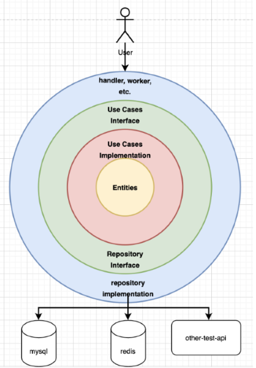

<style>
h1 {
  background-color: rgba(255,255,255,.7);
}
</style>

<section data-background-image="images/go/background.jpeg">

<br><br><br><br><br><br>

<h1>Interfaces en GO</h1>

</section>

---

## Temario

- Interfaces


---

### Interfaces

Interface en Go es el tipo de dato que en Go que representa un conjunto de funciones.

Si bien puede ser utilizado como el tipo de dato que representa a cualquier otro (posteriormente renombrado a any en el lenguaje) en sí define un listado de funciones entre sus llaves que deben ser implementadas para que otro tipo de dato la satisfaga.

```go
type Service interface{
    GetHotelByID(hotelID int64) (domain.Hotel, error)
}
```

---



---

### Interaces

La utilización de interfaces es muy útil para aplicar patrones de diseño como dependency injection y para implementar estilos de arquitectura como arquitectura hexagonal.

```go
type Redis struct {
    Client redis.Client
}

func (redis Redis) GetHotelByID(hotelID int64) (domain.Hotel, error) {
	return redis.Client.Get(key)
}

type Store interface{
    GetHotelByID(hotelID int64) (domain.Hotel, error)
}
```

---

## ¿Dudas, Preguntas, Comentarios?


