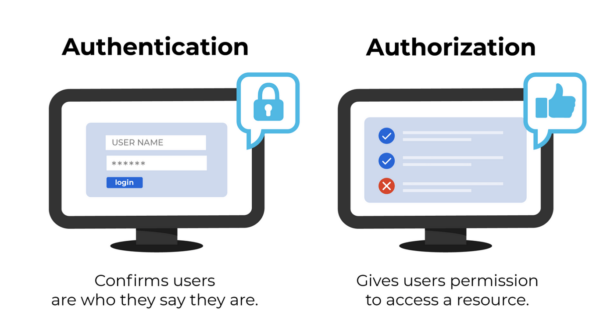
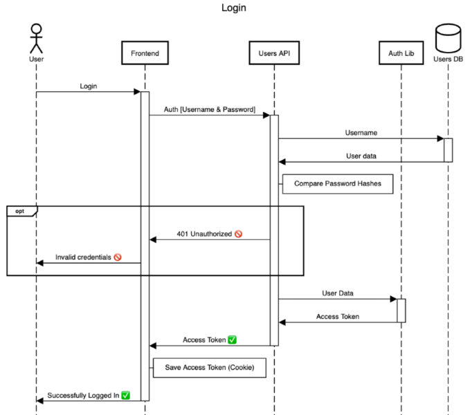

<style>
h1 {
  background-color: rgba(255,255,255,.7);
}
</style>

<section data-background-image="images/go/background.jpeg">

<br><br><br><br><br><br>

<h1>Auth e Interfaces en GO</h1>

</section>

---

## Temario

- Auth
- Tokenización
- JWT
- Hashing
- Interfaces

---

### Auth

El flujo de **autenticación (Auth)** resuelve la autorización de usuarios a realizar determinadas acciones. 
Por ejemplo:
- Mantener la sesión del frontend activa
- Operaciones de escritura
- Validación en flujos que requieran autenticación (por ej. chat)

Este flujo tiene que ver casi siempre con usuarios, pero no necesariamente tiene que estar relacionado con esta entidad.

---



---

### Tokenización

Normalmente, los flujos de autenticación utilizan alguna tecnología de tokenización para generar cadenas de caracteres 
firmados criptográficamente que permiten identificar a los usuarios.

---

### JWT: JSON Web Token

<!-- .slide: style="font-size: 0.90em" -->

Es un estándar abierto (RFC 7519) que se utiliza para transmitir información segura entre dos partes 
como un objeto JSON. Se usa comúnmente para autenticación y autorización en aplicaciones web.

Un token JWT está compuesto por:
- **Header:** tipo de token y algoritmo.
- **Payload:** datos del usuario (como su ID o rol).
- **Firma:** garantiza que el token no fue alterado.

El backend crea el token al iniciar sesión, y el frontend lo usa en cada request para identificarse.
Los tokens JWT se pueden validar en [https://jwt.io/](https://jwt.io/)

---

### Hashing

Un algoritmo de hashing es una función matemática que toma una entrada (o "mensaje") de cualquier tamaño y 
la convierte en una salida de tamaño fijo, llamada **hash** o **digest**. 

Esta salida es típicamente una cadena de caracteres que representa de forma única los datos de entrada.

---

### Hashing: Características

<!-- .slide: style="font-size: 0.85em" -->

1. **Determinístico:** La misma entrada siempre produce el mismo hash.
2. **Salida de tamaño fijo:** Independientemente del tamaño de la entrada, el hash siempre tiene el mismo largo (por ejemplo, 256 bits en SHA-256).
3. **Rápido de computar:** Es eficiente calcular el hash de cualquier dato.
4. **Difícil de invertir:** No debe ser posible (o al menos debe ser extremadamente difícil) reconstruir la entrada original a partir del hash.
5. **Resistencia a colisiones:** Es muy poco probable que dos entradas distintas generen el mismo hash.
6. **Avalancha:** Un pequeño cambio en la entrada cambia completamente el hash resultante.

---

### Hashing: Uso

- **Verificación de integridad:** Para comprobar que los datos no han sido modificados
- **Almacenamiento seguro de contraseñas:** Guardar solo el hash en lugar de la contraseña real.
- **Estructuras de datos eficientes:** Como tablas hash (hash maps).
- **Criptografía:** En firmas digitales, blockchain, y más.

Ejemplo:

Usando SHA-256, la palabra "hola" genera este hash:
```
7509e5bda0c762d2bac7f90d758b5b2263fa01ccbc5b552d0e5f7c4d5a87b6a0
```

---



---

### Interfaces

Las interfaces permiten definir un conjunto de métodos que deben ser implementados por otros tipos de datos.

Un interface en Go define un contrato que especifica qué métodos deben ser implementados por otros tipos de datos.

---

### Interfaces: Ejemplo

**animal.go**
```
package animal

import (
	"fmt"
)

type Animal interface {
	Sonido()
}

// Estructura de perro y sus métodos
type Perro struct {
	Nombre string
}

func (p *Perro) Sonido(){
		fmt.Println(p.Nombre + " hace guau guau")
}

// Estructura de gato y sus métodos
type Gato struct {
	Nombre string
}

func (g *Gato) Sonido(){
		fmt.Println(g.Nombre + " hace miau miau")
}

// Función para imprimir sonido
func HacerSonido(animal Animal){
	animal.Sonido()
}
```

---

### Interfaces: Ejemplo
**main.go**
```
package main

import (
	"animals-char/animal"
)

func main() {
	miPerro := animal.Perro{Nombre: "Laica"}
	miGato := animal.Gato{Nombre: "Tom"}

	//permite flexibilidad y reutilizacion de código
	animal.HacerSonido(&miPerro)
	animal.HacerSonido(&miGato)

	animales := []animal.Animal {
		&animal.Perro{Nombre: "Pluto"},
		&animal.Gato{Nombre: "Garfield"},
		&animal.Perro{Nombre: "Buddy"},
		&animal.Gato{Nombre: "Luna"},
	}

	for _, animal := range animales {
		animal.Sonido()
	}
}
```

---

Este ejemplo ilustra como las interfaces en Go nos permiten trabajar con diferentes tipos de datos
de manera uniforma, lo que facilita la escritura del código genérico y reutilizable.

Con un interface podes enviar varios tipos de datos sin preocuparnos por su implementación interna.

---

Una interfaz en Go es un tipo de dato que define un conjunto de métodos. 
Cualquier tipo que implemente esos métodos satisface automáticamente la interfaz, sin necesidad de declararlo explícitamente (esto se conoce como implementación implícita).

```go
type Service interface{
    GetHotelByID(hotelID int64) (domain.Hotel, error)
}
```

---

### Interaces: Patrones de Diseño

La utilización de interfaces es muy útil para aplicar patrones de diseño como dependency injection y para implementar estilos de arquitectura como arquitectura hexagonal.

```go
type Redis struct {
    Client redis.Client
}

func (redis Redis) GetHotelByID(hotelID int64) (domain.Hotel, error) {
	return redis.Client.Get(key)
}

type Store interface{
    GetHotelByID(hotelID int64) (domain.Hotel, error)
}
```

---


---

### Interaces: Patrones de Diseño

<!-- .slide: style="font-size: 0.60em" -->

La imagen representa una **arquitectura hexagonal** o **Clean Architecture**, que posee una estructura desacoplada y modular.
- **Entidades:** 
    - Es el centro del sistema. 
    - Contiene la lógica de negocio más pura y estable.
    - No depende de nada externo, ni de bases de datos ni de frameworks.
    - Ejemplo: estructuras como Hotel, User, etc., y sus reglas de validación.
- **Casos de Uso:**
    - Implementa la lógica de aplicación específica.
    - Aquí es donde se usan las interfaces para abstraer acceso a datos (repositorios) o servicios externos.
    - Define los servicios que la app ofrece al mundo exterior.
    - Ejemplo: GetHotelByID, CreateReservation, CancelBooking.
- **Use Cases Interface:**
    - Define interfaces que exponen las funcionalidades de los casos de uso.
    - Capa que los adaptadores (handlers, workers, etc.) usan para interactuar con la lógica.
    - Por ejemplo, la interfaz Service (GetHotelByID(hotelID int64)) podría estar aquí.

---

### Interaces: Patrones de Diseño

<!-- .slide: style="font-size: 0.60em" -->

- **Repository Interface**
    - Interfaces que definen cómo acceder a datos (sin importar de dónde vienen).
    - Los casos de uso las usan para guardar o recuperar datos.
    - Ejemplo: HotelRepository con métodos como FindByID.
- **Repository Implementation**
    - Aquí están las implementaciones concretas de las interfaces de repositorio.
    - Puede haber múltiples implementaciones: MySQL, Redis, APIs externas, etc.
    - Dependencia hacia adentro: esta capa depende de las interfaces, no al revés.
- **Usuario y Adaptadores** (fuera del círculo)
    - Son puntos de entrada de tu aplicación.
    - Pueden ser: Handlers HTTP, Workers, CLI
    - Usan las interfaces expuestas por los casos de uso para interactuar con la lógica.
- **Sistemas externos** (abajo del todo)
    - Son bases de datos, caches, APIs de terceros.
    - La aplicación no depende directamente de ellos, sino que lo hace a través de interfaces.
    - Esto permite cambiar MySQL por PostgreSQL, o Redis por Memcached sin romper tu lógica de negocio.

---

## ¿Dudas, Preguntas, Comentarios?


