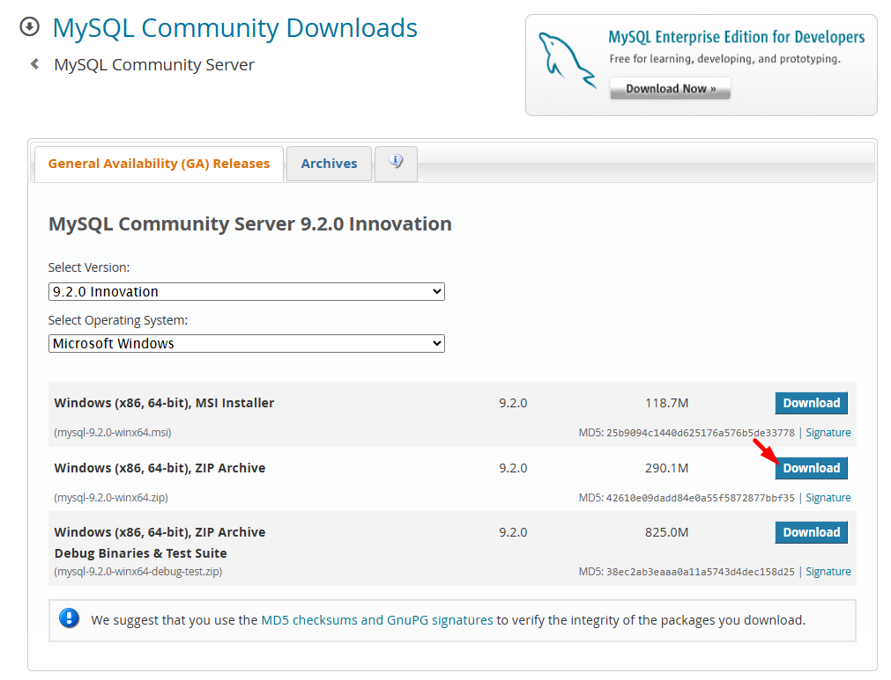

# Base de Datos MySQL

---

## Temario

---

### Instalar MySQL

1. Ingresamos a [https://www.mysql.com/downloads/](https://www.mysql.com/downloads/)
2. Click en **MySQL Community**
3. Seleccionar "MySQL Community Server"
4. Seleccionar en el menú depslegable la versión según el SO

---

### Instalar el Driver para Go

1. Ingresar a https://go.dev/wiki/SQLDrivers
2. Click en el link de "MySQL" (nos redirecciona acá https://github.com/go-sql-driver/mysql/)
3.

---

## ¿Dudas, Preguntas, Comentarios?

