# Docker

---

## Temario

- Deploy
- Máquinas Virtuales
- Docker
- TL;DR
- Comandos Docker
- Docker File
- Recomendaciones
- Terminal

---

### Deploy

El despliegue de software es el proceso de entregar el software completado al cliente que lo solicitó o implementarlo 
para los consumidores. El despliegue de software solo debe realizarse después de pruebas exhaustivas para garantizar 
que todos los errores y fallas hayan sido identificados y corregidos.

---

## Virtual Machine

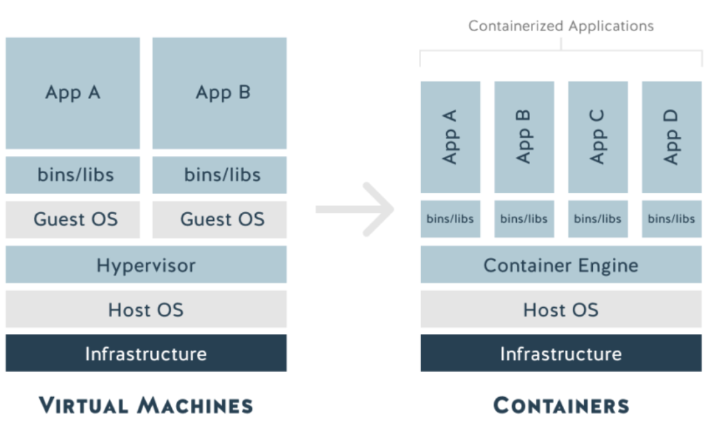

---

## Docker

<!-- .slide: style="font-size: 0.90em" -->

Docker es una herramienta que permite a los desarrolladores, administradores de sistemas, etc., implementar fácilmente 
sus aplicaciones en un entorno aislado (llamado contenedor) para ejecutarse en el sistema operativo anfitrión, es decir, Linux.

El principal beneficio de Docker es que permite a los usuarios empaquetar una aplicación con todas sus dependencias en 
una unidad estandarizada para el desarrollo de software. A diferencia de las máquinas virtuales, los contenedores no 
tienen una gran sobrecarga, lo que permite un uso más eficiente del sistema y los recursos subyacentes.

---

## Docker

<!-- .slide: style="font-size: 0.90em" -->

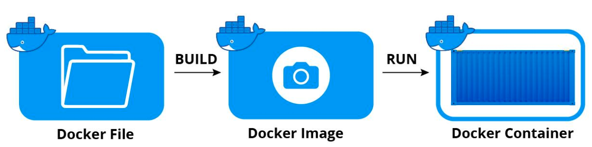

La imagen de docker puede ser propia o de un tercero.

El Registry es una aplicación del lado del servidor sin estado y altamente escalable que almacena y permite distribuir 
imágenes de Docker. El Registry es de código abierto y está bajo la licencia permisiva Apache.

---

## TL;DR

<!-- .slide: style="font-size: 0.80em" -->

- Cada capa es una imagen en sí misma, solo que sin una etiqueta asignada por un humano. Sin embargo, tienen IDs generados automáticamente.
- Cada capa almacena los cambios en comparación con la imagen en la que se basa.
- Una imagen puede estar compuesta por una sola capa (esto suele ocurrir cuando se usa el comando squash).
- Cada instrucción en un Dockerfile genera una nueva capa. (Excepto en compilaciones multi-etapa, donde generalmente solo se incluyen las capas de la imagen final, o cuando una imagen se aplana en una sola capa).
- Las capas se utilizan para evitar transferir información redundante y omitir pasos de compilación que no han cambiado (según la caché de Docker).

---

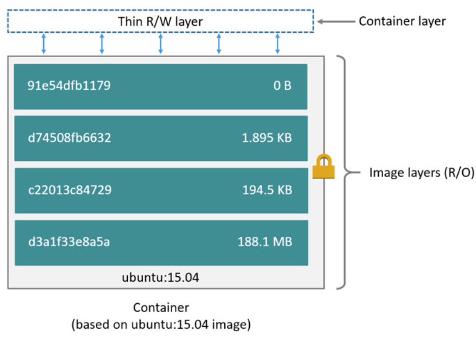

---

## Comandos Docker Terminal

```bash
Install Docker

docker images ls

docker container ls

docker pull {name}:{tag}

docker pull {name}:{latest}

docker pull golang:latest

docker run {name}:{tag}

docker run {name}:{latest}

docker run golang:latest

docker run -d -p 80:80 docker/getting-started

docker ps

docker exec -it -t {container} sh
  // ejecuta una terminal en el contenedor
  // -i interactive
  // -t terminal
```

---

## Docker File

```bash []
# syntax=docker/dockerfile:1

FROM golang:1.18.1-alpine3.15
WORKDIR /app

COPY . .
RUN go mod download
RUN go build -o /docker-go

EXPOSE 8081

CMD [ "/docker-go" ]
```

```bash
docker build -t docker-go .
docker run -d -p 8080:8080 docker-go:0.0.1
```

---

## Docker File

```bash
El comando -v permite compartir un volumen para almacenamiento de datos

docker logs -f {container}
Permite ver los logs del contenedor

docker push emikohmann/docker-go:0.0.1
```

---

## Docker: Recomendación

- Generalmente los datos que se manejan dentro de los container son volátiles, es decir que si los almacenamos en el container se pueden perder.
- Por eso se recomienda gestionarlo de alguna manera que nos permita recuperarlos o utilizarlos sin depender de un container ID.
- Tener en cuenta que generalmente nos vamos a basar en imágenes para correr las aplicaciones.

---

## Docker: terminal

```bash
ekohmann @ docker-go $ docker images
REPOSITORY               TAG       IMAGE ID       CREATED              SIZE
docker-go                latest    53dcdeeb3c6c   About a minute ago   423MB
ubuntu                   latest    d2e4e1f51132   3 days ago           77.8MB
golang                   latest    65375c930b21   12 days ago          964MB
docker/getting-started   latest    cb90f98fd791   3 weeks ago          28.8MB
alpine                   latest    0ac33e5f5afa   4 weeks ago          5.57MB
```

---

## Docker: terminal

```bash
[GIN-debug] [WARNING] Running in "debug" mode. Switch to "release" mode in production.
 - using env:   export GIN_MODE=release
 - using code:  gin.SetMode(gin.ReleaseMode)

[GIN-debug] GET    /ping                     --> main.main.func1 (1 handlers)
[GIN-debug] [WARNING] You trusted all proxies, this is NOT safe. We recommend you to set a value.
Please check https://pkg.go.dev/github.com/gin-gonic/gin#readme-don-t-trust-all-proxies for details.
[GIN-debug] Listening and serving HTTP on :8081
```

---

## Docker: terminal

```bash
docker network -d create docker-net
```

---

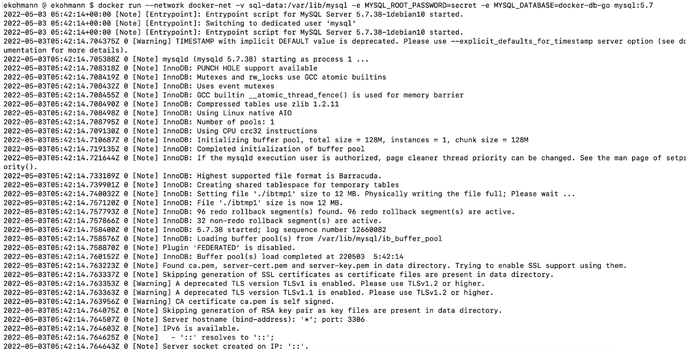

---

## Docker: terminal

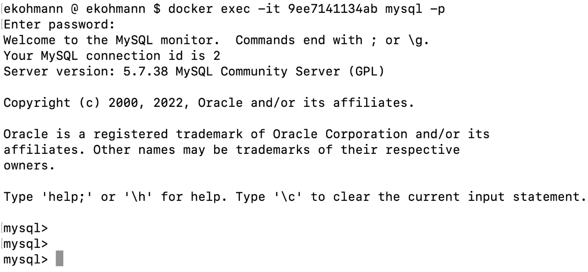

---

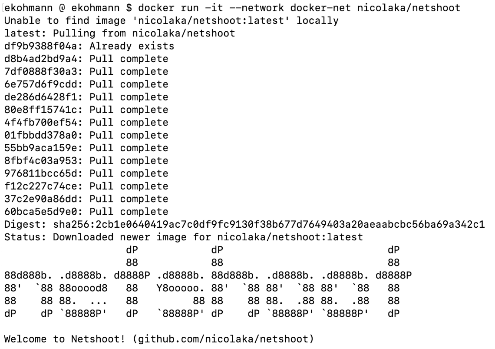

---

## Docker: terminal

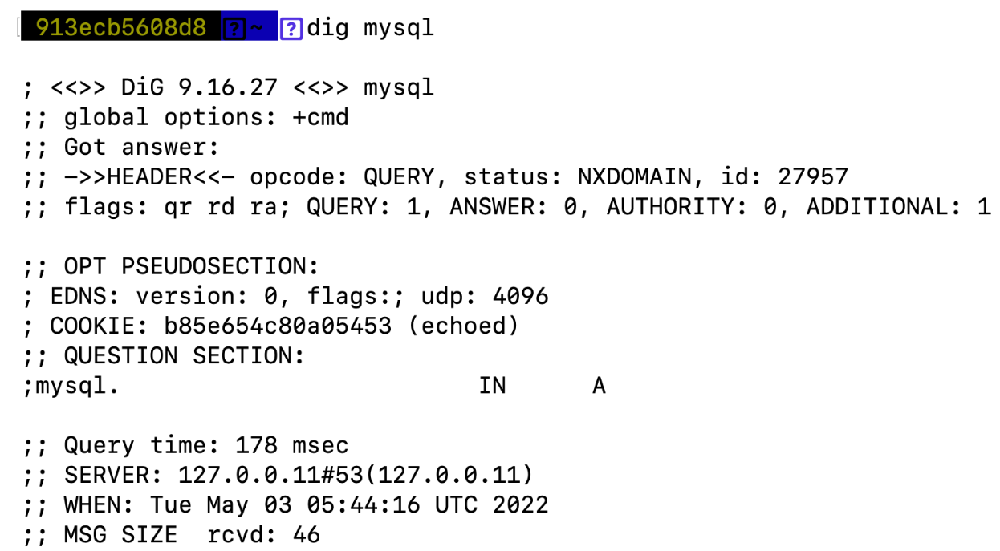

---

## Docker Compose

```bash []
version: "3.7"

services:

  #docker run -dp 3000:3000 --network todo-app -e MYSQL_HOST=mysql -e MYSQL_USER=root -e MYSQL_PASSWORD=secret -e MYSQL_DB=docker-db getting-started:v2

   app:
     image: emikohmann/example:v1
     ports:
       - 3000:3000
     environment:
       MYSQL_HOST: mysql
       MYSQL_USER: root
       MYSQL_PASSWORD: secret
       MYSQL_DB: todos


# docker run -d     --network todo-app --network-alias mysql     -v todo-mysql-data:/var/lib/mysql     -e MYSQL_ROOT_PASSWORD=secret     -e MYSQL_DATABASE=docker-db     mysql:5.7

   mysql:
     image: mysql:5.7
     volumes:
       - ./todo-mysql-data:/var/lib/mysql
     environment:
       MYSQL_ROOT_PASSWORD: secret
       MYSQL_DATABASE: todos
```

---

## Docker Compose

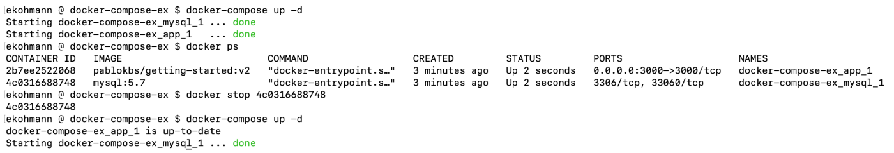

---

## Docker Compose

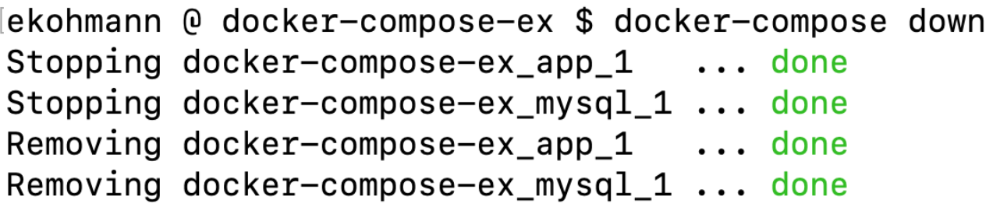

---

## Docker Images

[https://docker-curriculum.com/#docker-images](https://docker-curriculum.com/#docker-images)

---


### Docker Compose

Objetivo: Conectar dos contenedores, un
microservicio con una base de datos.

---

## Ejemplo

```go []
package main

import (
    "fmt"
    "github.com/gin-gonic/gin"
    "net/http"
)

type Body struct {
    // json tag to serialize json body
    Name string `json:"name"`
}

func main() {
    engine := gin.New()
    engine.POST("/test", func(context *gin.Context) {
        body := Body{}
        // using BindJSON method to serialize body with struct
        if err := context.BindJSON(&body); err != nil {
            context.AbortWithError(http.StatusBadRequest, err)
            return
        }

        fmt.Println(body)
        context.JSON(http.StatusAccepted, &body)
    })
    engine.Run(":3000")
}
```

---

## Ejemplo: Dockerfile

```bash []
FROM golang:1.17

RUN mkdir /gin

ADD . /gin

WORKDIR /gin

RUN go mod init gin
RUN go mod tidy

RUN go build -o gin .

RUN chmod +x /gin/gin

ENTRYPOINT ["/gin/gin"]
```

```bash
docker build -t gin:latest .
docker run -p 3001:3000 gin
```

---

**MAC M1**

```
docker run --name class-mysql -e MYSQL_ROOT_PASSWORD=pass

--publish 3306:3306 -d arm64v8/mysql:oracle
```

**Linux - Windows - Mac**

```
docker run --name class-mysql -e MYSQL_ROOT_PASSWORD=pass

--publish 3306:3306 -d mysql:5.7
```

---

```
docker ps
docker exec -it [id-contenedorSql] bash
mysql -p
```

**file**

```sql []
CREATE DATABASE nums;

USE nums;

CREATE TABLE squarenum (
    number INT,
    squareNumber INT
);
```

---

```go []
package main

import (
    "database/sql"
    "fmt"
    _ "github.com/go-sql-driver/mysql"
)

func main() {
    // Conectar a la base de datos MySQL
    db, err := sql.Open("mysql", "root:pass@tcp(127.0.0.1:3306)/nums")
    if err != nil {
        panic(err.Error()) // Para propósitos de ejemplo, se recomienda un mejor manejo de errores
    }
    defer db.Close()

    // Preparar una sentencia para eliminar datos de la tabla
    stmtDel, err := db.Prepare("DELETE FROM squarenum;") // ? = marcador de posición
    if err != nil {
        panic(err.Error()) // Manejo de errores adecuado en vez de un panic en producción
    }
    defer stmtDel.Close()

    // Preparar una sentencia para insertar datos en la tabla
    stmtIns, err := db.Prepare("INSERT INTO squarenum VALUES( ?, ? )") // ? = marcador de posición
    if err != nil {
        panic(err.Error()) // Manejo de errores adecuado
    }
    defer stmtIns.Close() // Cerrar la sentencia cuando el programa finaliza
}
```

---

```go []
// Preparar una sentencia para leer datos
stmtOut, err := db.Prepare("SELECT squareNumber FROM squarenum WHERE number = ?")
if err != nil {
    panic(err.Error()) // Se recomienda un mejor manejo de errores en producción
}
defer stmtOut.Close()

// Ejecutar la eliminación de registros en la tabla
_, err = stmtDel.Exec()
if err != nil {
    panic(err.Error()) // Manejo de errores adecuado en lugar de panic
}

// Insertar números cuadrados para valores de 0 a 24 en la base de datos
for i := 0; i < 25; i++ {
    _, err = stmtIns.Exec(i, (i * i)) // Inserta tuplas (i, i^2)
    if err != nil {
        panic(err.Error()) // Manejo de errores adecuado
    }
}
```

---

```go []
var squareNum int // Variable para almacenar el resultado

// Consultar el cuadrado del número 13
err = stmtOut.QueryRow(13).Scan(&squareNum) // WHERE number = 13
if err != nil {
    panic(err.Error()) // Manejo adecuado de errores en lugar de panic en producción
}
fmt.Printf("The square number of 13 is: %d \n", squareNum)

// Consultar otro número, por ejemplo, el 1
err = stmtOut.QueryRow(1).Scan(&squareNum) // WHERE number = 1
if err != nil {
    panic(err.Error()) // Manejo adecuado de errores en lugar de panic en producción
}
fmt.Printf("The square number of 1 is: %d \n", squareNum)

```

```bash
docker ps
docker exec -it [id-contenedorSql] bash
mysql -p
use nums;
select * form squarenum;
```

---

```go []
package main

import (
    "database/sql"
    "fmt"
    "net/http"

    _ "github.com/go-sql-driver/mysql"
    "github.com/gin-gonic/gin"
)

// Definir la estructura Body con JSON serialization
type Body struct {
    Number int `json:"number"`
}

func main() {
    // Conectar a la base de datos MySQL
    db, err := sql.Open("mysql", "root:pass@tcp(dbmysql:3306)/nums")
    if err != nil {
        panic(err.Error()) // Manejo de errores básico, mejor evitar panic en producción
    }
    defer db.Close()

    // Preparar una consulta para obtener el cuadrado de un número
    stmtOut, err := db.Prepare("SELECT squareNumber FROM squarenum WHERE number = ?")
    if err != nil {
        panic(err.Error()) // Manejo de errores adecuado
    }
    defer stmtOut.Close()

    // Crear una instancia de Gin
    engine := gin.New()

    // Definir una ruta GET para consultar el número cuadrado
    engine.GET("/test", func(context *gin.Context) {
        // Variable para almacenar el resultado de la consulta
        squareNum := 0

        // Crear una estructura Body para la respuesta
        body := Body{}

        // Ejecutar la consulta para obtener el cuadrado del número 13
        err = stmtOut.QueryRow(13).Scan(&squareNum) // WHERE number = 13
        if err != nil {
            panic(err.Error()) // Manejo adecuado de errores
        }

        // Asignar el valor obtenido a la estructura Body
        body.Number = squareNum

        // Responder con el JSON del número cuadrado
        context.JSON(http.StatusAccepted, body)
    })

    // Iniciar el servidor en el puerto 3000
    engine.Run(":3000")
}

```

---

## Dockerfile

```bash []
FROM golang:1.17

RUN mkdir /gin

ADD . /gin

WORKDIR /gin

RUN go mod init gin
RUN go mod tidy

RUN go build -o gin .

RUN chmod +x /gin/gin

ENTRYPOINT ["/gin/gin"]

```

---

## docker-compose.yml

```yml []
version: "3"

services:
  dbmysql:
    image: arm64v8/mysql:oracle
    environment:
      MYSQL_ROOT_PASSWORD: pass
    ports:
      - "3306:3306"
    volumes:
      - ./db:/docker-entrypoint-initdb.d
    healthcheck:
      test:
        [
          "CMD",
          "mysqladmin",
          "ping",
          "-h",
          "localhost",
          "-u",
          "root",
          "-p$MYSQL_ROOT_PASSWORD",
        ]
      timeout: 20s
      retries: 10

  web:
    build: .
    container_name: gin
    depends_on:
      dbmysql:
        condition: service_healthy
    ports:
      - "3000:3000"
```

---

## db-create.sql

```sql []
CREATE DATABASE nums;

USE nums;

CREATE TABLE squarenum (
    number INT,
    squareNumber INT
);

INSERT INTO squarenum VALUES (13, 169);
```

---


### Historia de la virtualización

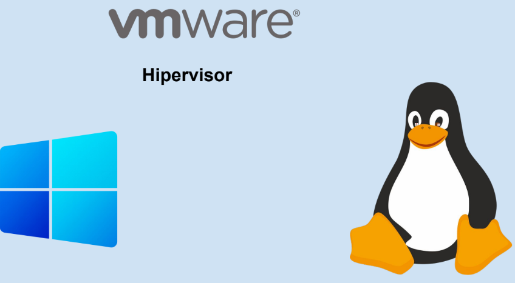

---

## Virtualización de procesos

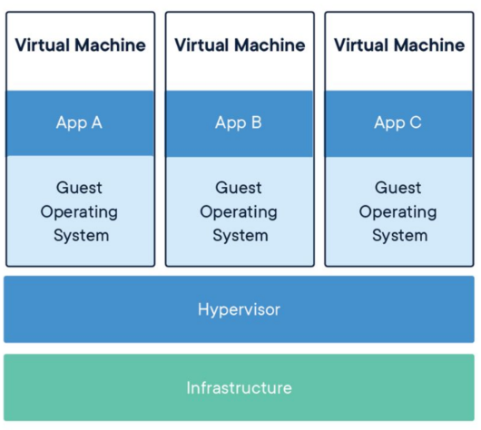

---

## ¿Que es un Container?

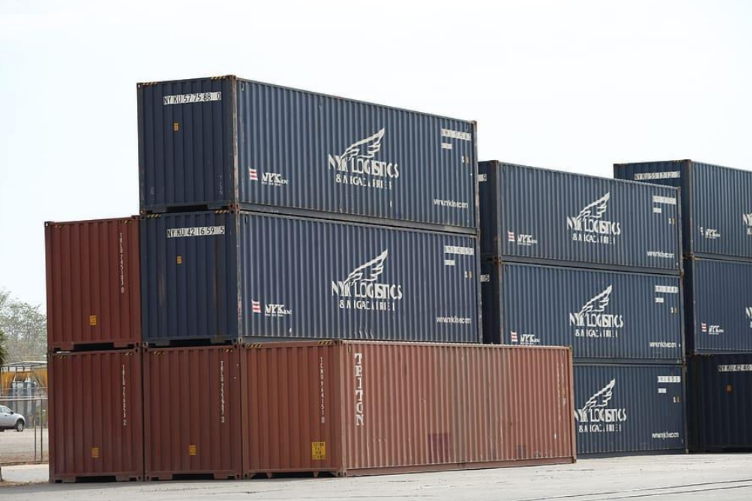

---

## Docker

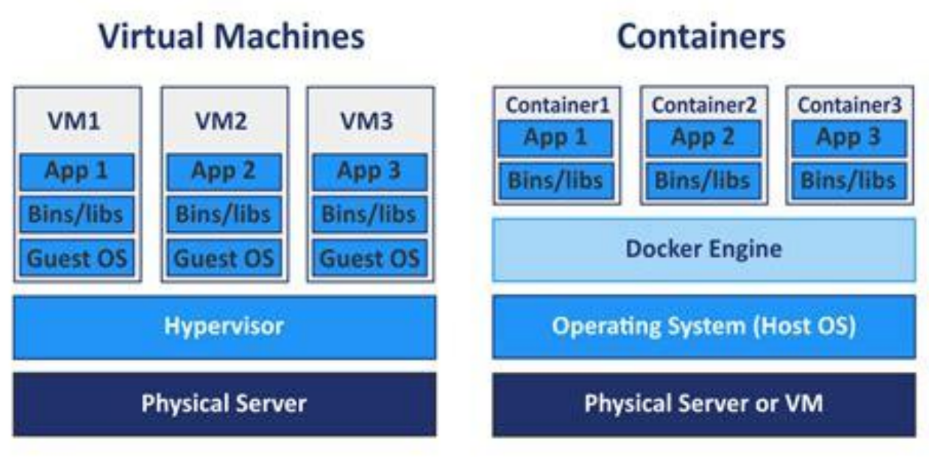

---

## Vista de arquitectura de docker - foto completa

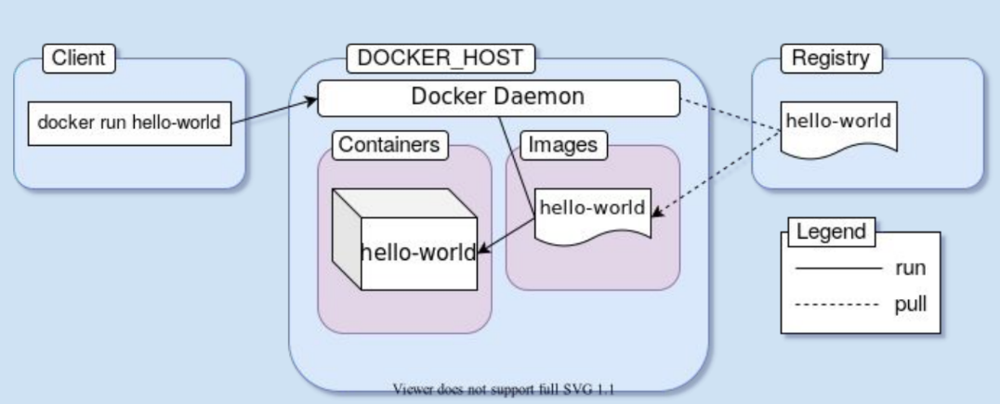

---


---

## ¿Dudas, Preguntas, Comentarios?


