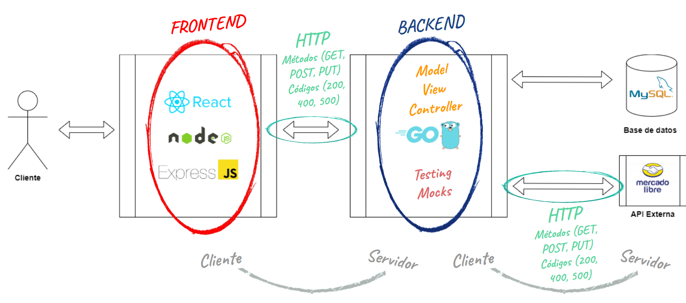

# CORS

<style>
h1 {
  background-color: rgba(255,255,255,.7);
}

.small{
	font-size: 0.2em
}
</style>

---

## Temario
- Cors

---

### CORS

CORS (Cross-Origin Resource Sharing) es un mecanismo de seguridad que implementan los navegadores para controlar qué recursos pueden ser accedidos desde otro origen.
Por ejemplo: El frontend en **localhost:3000** o **localhost:5173**  intenta hacer una petición **fetch()** a un backend en **localhost:8080**. Aunque parezca el mismo host, el puerto cambia, entonces el navegador lo considera un "origen cruzado" y bloquea la petición a menos que el backend diga que lo permite.

---

### Configurar CORS en GO

<!-- .slide: style="font-size: 0.80em" -->

Cuando se agrega esto en el handler o middleware:
- c.Header("Access-Control-Allow-Origin", "*")
- c.Header("Access-Control-Allow-Methods", "GET, POST, PUT, DELETE, OPTIONS")
- c.Header("Access-Control-Allow-Headers", "Content-Type, Authorization")

Estás diciéndole al navegador:
- **Allow-Origin:** "Cualquier frontend puede acceder a mi backend" (ideal para desarrollo).
- **Allow-Methods:** "Permití estos métodos HTTP".
- **Allow-Headers:** "Permití que vengan estos headers" (como Content-Type, Authorization, etc)

---

### Cors

<!-- .slide: style="font-size: 0.90em" -->

Para configurar **CORS** de una manera más robusta, segura y correcta se recomienda [https://github.com/gin-contrib/cors](https://github.com/gin-contrib/cors)

1. Ejecuta:
```bash
go get github.com/gin-contrib/cors
```
2. Antes de las rutas:
```go
router.Use(cors.New(cors.Config{
  AllowOrigins:     []string{"http://localhost:5173"}, // o 3000
  AllowMethods:     []string{"GET", "POST", "PUT", "DELETE", "OPTIONS"},
  AllowHeaders:     []string{"Origin", "Content-Type", "Authorization"},
  ExposeHeaders:    []string{"Content-Length"},
  AllowCredentials: true,
  MaxAge:           12 * time.Hour,
}))
```

---

### Ejercicio 5: Go CORS & React

1. Crea un componente para visualizar el listado de vinilos
2. Emplea un **fetch** para traer los datos que obtendrias con el **GET**
2. Configura CORS para que los vinilos puedan visualizarse

---

### Ejercicio 5: Go CORS & React

<iframe width="560" height="315" src="https://www.youtube.com/embed/cqt28QG9-PE?si=ELgKoqUI4WLWz8E6" title="YouTube video player" frameborder="0" allow="accelerometer; autoplay; clipboard-write; encrypted-media; gyroscope; picture-in-picture; web-share" referrerpolicy="strict-origin-when-cross-origin" allowfullscreen></iframe>

---

### Documentación de una API

Las **APIS** tienen disponible documentos donde se especifica cómo interactuar con ellas para enviar y recibir datos.

---

### Documentación de una API

<!-- .slide: style="font-size: 0.80em" -->

Para consumir una API necesitamos conocer:

- El método **HTTP** (GET, POST, PUT, DELETE, etc.)
- Las URL, que están conformadas por:
  - **Base URL:** Es la ruta básica a partir de la cual se forman todos los endpoints disponibles para consumir. Por ej. [http://api.mercadolibre.com/](http://api.mercadolibre.com/)
  - **Endpoint:** Es el path dentro de la API para acceder al recurso solicitado. Por ej. [/sites/MLA/categories]()
  - **Parámetros:** Son un conjunto de valores que se envían en la misma dirección. Se especifican mediante nombre=valor y se separan mediante el caracter &.
- El cuerpo del mensaje, llamado **body**.
- Las cabeceras del mensaje, llamados **headers**.

---

## Paquete HTTP

El paquete HTTP nos permite realizar peticiones y procesar los datos correspondientes a una solicitud HTTP, además de contar con variables, constantes y funciones útiles en este procesamiento. Para utilizarlo, debemos:

Importar el paquete HTTP:

```go
import "net/http"
```

---

## Paquete HTTP

<!-- .slide: style="font-size: 0.80em" -->

Invocar a la función correspondiente mediante http. Métodos básicos:

- **GET**

```go
resp := http.Get(url)
```

- **POST**

```go
resp := http.Get(url, body)
```

Luego, debemos leer los bytes de esta respuesta mediante:

```go
data, err := ioutil.ReadAll(resp.Body)
```

---

## Paquete HTTP

Una vez obtenidos los bytes, debemos crear una variable del tipo de dato que estamos esperando recibir.

```go
var myVar myStruct
```

Ahora debemos asociar toda la información contenida en el cuerpo de mensaje con nuestra estructura. Para esto, debemos tener en cuenta las anotaciones especificadas a la derecha de cada uno de los atributos de nuestra estructura e invocar un método del paquete encoding/json.

---

## Paquete ENCODING/JSON

El paquete ENCODING/JSON nos disponibiliza un gran número de funciones y útiles para trabajar con datos en formato json.
Para consumir una API, debemos desplegar, o asociar los datos obtenidos en una variable del tipo deseado. Para esto se utiliza la función **unmarshal** de la siguiente manera:

```go
err := json.Unmarshal(bytes, &myVar)
```

---

## Paquete ENCODING/JSON

Donde bytes, es el conjunto de bytes que leímos de la response y &myVar es la dirección de memoria del objeto creado anteriormente que se rellenará con los datos mediante las notations.

Si en este punto no obtenemos ningún error, entonces ya podríamos acceder a los valores de los atributos de nuestra variable tal como nos llegaron en el cuerpo de la respuesta a nuestra solicitud.

---

## Arquitectura web



---

## Conectar frontend con backend

- Completar la vista del ítem
- Crear la carpeta frontend/server
  - Package.JSON
  - Server.JS
- Implementar la llamada a localhost:5001 en **useEffect** del componente

---

## Conexión frontend con backend


---

## ¿Dudas, Preguntas, Comentarios?


