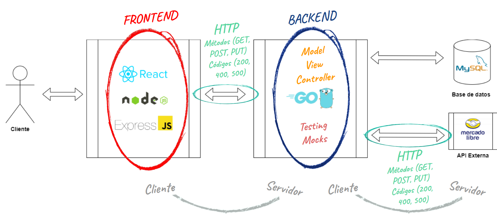
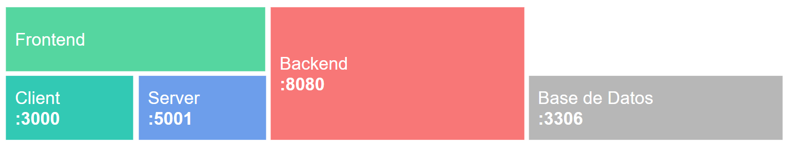

# Frontend - Node + React

---

## Temario
- Node JS
- npm
- npx
- React

---

### Node.js 

Es un entorno de ejecución de JavaScript que permite correr código JS fuera del navegador (por ejemplo, en la terminal o en un servidor).
Lo usamos porque muchas herramientas modernas de desarrollo frontend están escritas en JavaScript y necesitan un entorno para ejecutarse.

---

### npm 

Son las siglas de **Node Package Manager.
Es el sistema que usamos para instalar y gestionar librerías o herramientas escritas en JavaScript.
Se instala automáticamente cuando instalás Node.js.

Pensalo como un "App Store" para desarrolladores JavaScript.

---

### npx

Es una herramienta que viene con npm.
Sirve para ejecutar paquetes que no tenemos instalados globalmente.
Por ejemplo, `npx create-react-app` te permite usar `create-react-app` sin instalarlo primero.

Ventaja: Siempre se usa la última versión del paquete, sin ensuciar el sistema.

---

### React 

Es una librería de JavaScript para construir interfaces de usuario.

Fue creada por Facebook.

Su gran ventaja es que permite crear componentes reutilizables.

---

### create-react-app

Es una herramienta de React para crear un proyecto listo para usar sin configurar nada.

Genera toda la estructura básica (archivos, carpetas, configuraciones, scripts, etc.).

Ahorra tiempo configurando Webpack, Babel, ESLint, etc.

---

### Ejercicio: Instalar Node.Js

1. Ingresar a https://nodejs.org/en
2. Descargar e instalar Node 22.14.0 o superior (si trabajas en múltiples proyectos te recomiendo emplear [nvm](https://github.com/coreybutler/nvm-windows/releases))
3. En una terminal verificar que la instalación se realizó correctamente
```bash
node -v
npm -v
npx -v
```

---

### Proyecto: Crear la app base frontend

1. Ejecutar en comando 
```bash
npm create-react-app@latest frontend
```
2. Ir al directorio del proyecto `cd frontend`
3. Ejecutar el proyecto con `npm start`


---

## Arquitectura web



---

## Frontend

- Descargar e instalar NodeJS desde https://nodejs.org/en/download
- Ir a la carpeta de la materia _/frontend_
- Ejecutar

```bash
npx create-react-app client
```

---

## Conectar frontend con backend

- Completar la vista del ítem
- Crear la carpeta frontend/server
  - Package.JSON
  - Server.JS
- Implementar la llamada a localhost:5001 en **useEffect** del componente

---

## Conexión frontend con backend



---

## ¿Dudas, Preguntas, Comentarios?


