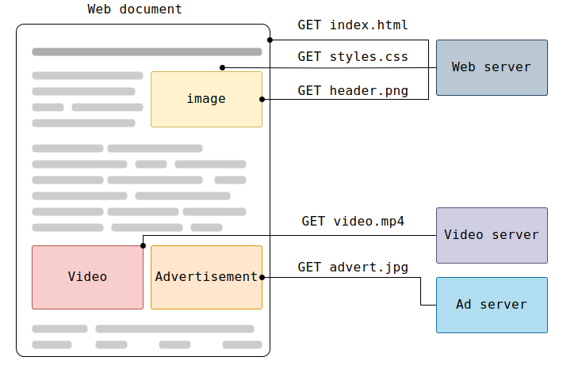

# HTTP

<style>
	.p-12 {
		font-size: 0.6em;
	}

.grid-container2 {
    display: grid;
    grid-template-columns: auto auto;
    font-size: 0.8em;
    text-align: left !important;
}

.grid-item {
    border: 3px solid rgba(121, 177, 217, 0.8);
    padding: 20px;
    text-align: left !important;
}
</style>

---

## Temario

<div class="grid-container2">
<div class="grid-item">

- Generalidades
- Arquitectura de los sistemas basados en HTTP
- Servidor Web
- Proxies
- Características del Protocolo http
- ¿Qué se puede controlar con http?
- Flujo HTTP
- Mensajes

</div>
<div class="grid-item">

- Tipos de Recursos
- Ej: Análisis de Peticiones
- Swagger
- Ej. Swagger
- Postman
- Ej. Postman
- cURL

</div></div>

---

## HTTP: Generalidades

**Hypertext Transfer Protocol** (HTTP) es un protocolo de la capa de aplicación para la transmisión de documentos hipermedia, como HTML.
Fue diseñado para la comunicación entre los navegadores y servidores web.

Es un protocolo sin estado, es decir, que cada petición es independiente.
Aunque en la mayoría de casos se basa en una conexión del tipo TCP/IP, se puede usar sobre cualquier capa de transporte segura (no como UDP, que puede perder mensajes).

---

### HTTP: Generalidades

<!-- .slide: style="font-size: 0.55em" -->

Sigue el modelo **cliente-servidor**, en el que un cliente establece una conexión con el servidor, realiza una petición y espera hasta que recibe una respuesta.

Una página web resulta de la unión de distintos sub-documentos recibidos: estilo (CSS), el texto, las imágenes, vídeos, scripts, etc...



---

### HTTP: Generalidades

Clientes y servidores se comunican intercambiando mensajes individuales.
Los mensajes que envía el cliente se llaman **peticiones**, y los mensajes enviados por el servidor se llaman
**respuestas**


---

### Arquitectura de los sistemas basados en HTTP

Las peticiones son enviadas por una entidad: el agente del usuario (normalmente un navegador Web).
Entre cada petición y respuesta, hay varios intermediarios, normalmente denominados proxies, los cuales realizan distintas
funciones, como: gateways (puerta de enlace) o caches (almacena termporalmente respuestas http).


---

#### HTTP: Servidor Web

Un servidor "sirve" los datos pedidos por el cliente.
Un servidor se considera una entidad única, aunque puede estar formado por varios elementos:

- Balanceador de carga
- Gestores de cache
- Bases de datos
- Correo electrónico

Un servidor no tiene que ser un único equipo físico.
Varios servidores pueden estar funcionando en un único computador.

---

### Proxies

<!-- .slide: style="font-size: 0.90em" -->

Pueden modificar o no las peticiones que pasan por ellos, cumpliendo estas funciones:

- caching (la caché puede ser pública o privada, como la caché de un navegador)
- filtrado (como un anti-virus, control parental, ...)
- balanceo de carga de peticiones (para permitir a varios servidores responder a la carga total de peticiones que reciben)
- autentificación (para el control al acceso de recursos y datos)
- registro de eventos (para tener un histórico de los eventos que se producen)

---

### Características del protocolo HTTP

- Es sencillo
<p class="fragment p-12"> Esta pensado y desarrollado para ser leído y fácilmente interpretado por las personas. Fácil la depuración de errores. </p>

- HTTP es extensible
<p class="fragment p-12">Las cabeceras de han hecho que sea fácil de ampliar y de experimentar.</p>
- HTTP es un protocolo con sesiones, pero sin estados
<p class="fragment p-12"> No guarda ningún dato entre dos peticiones en la mísma sesión. El uso de cookies permite guardar datos con respecto a la sesión de comunicación. </p>
- HTTP y conexiones
<p class="fragment p-12">No se requiere que se mantenga una conexión continua entre los participantes en la comunicación.</p>

---

### ¿Qué se puede controlar con HTTP?

- cache: que podemos almacenar y por cuanto tiempo.
- Flexibilidad del requisito de origen (cabeceras http)
- Autentificación
- Proxies y tunneling (esconder IP en intranets)
- Sesiones (cookies)

---

### Flujo de HTTP: Comunicación Cliente-Servidor

1. Abre una conexión TCP
2. Hace una petición HTTP

```
GET / HTTP/1.1 Host: developer.mozilla.org Accept-Language: fr
```

3. Leer la respuesta enviada por el servidor:

```html
    HTTP/1.1 200 OK
    Date: Sat, 09 Oct 2010 14:28:02 GMT
    Server: Apache
    Last-Modified: Tue, 01 Dec 2009 20:18:22 GMT
    ETag: "51142bc1-7449-479b075b2891b"
    Accept-Ranges: bytes
    Content-Length: 29769
    Content-Type: text/html

    <!DOCTYPE html... (here comes the 29769 bytes of the requested web page)
```

4. Cierre o reuso de la conexión para futuras peticiones.

---


<!-- Secure Sockets Layer -->

---

## Mensajes HTTP

- Peticiones
- Respuestas

---

## Mensajes HTTP: Peticiones

<!-- .slide: style="font-size: 0.90em" -->

Se compone de:

- Un **método HTTP**: GET, POST, PUT, DELETE, PATCH, TRACE, CONNECT, OPTIONS, HEAD, que defina la operación que el cliente quiera realizar. También llamado verbo.
- La **dirección** o URL del recurso.
- La versión del protocolo HTTP.
- **Cabeceras HTTP** opcionales, que aportam información adicional a los servidores.
- Un **cuerpo de mensaje**, en algún método, como puede ser POST, en el cual envía la información para el servidor.

---

## Mensajes HTTP: Peticiones


---

#### Mensajes HTTP: Peticiones - Métodos

<!-- .slide: style="font-size: 0.80em" -->

- **GET:** Solicitar datos.
- **HEAD:** Similar a GET, pero sin el cuerpo de la respuesta.
- **POST:** Enviar un recurso, causando a menudo un cambio en el estado o efectos secundarios en el servidor.
- **PUT:** Reemplaza todas las representaciones actuales del recurso de destino con la carga útil de la petición.
- **DELETE:** Borra un recurso en específico.
- **CONNECT:** Establece un túnel hacia el servidor identificado por el recurso.
- **OPTIONS:** Describir las opciones de comunicación para el recurso de destino.
- **TRACE:** Realiza una prueba de bucle de retorno de mensaje a lo largo de la ruta al recurso de destino.
- **PATCH:** Aplicar modificaciones parciales a un recurso.

---

#### Mensajes HTTP: Peticiones - Cabeceras

- **Cabeceras generales:** Como _Via_, afectan al mensaje como una unidad completa.
- **Cabeceras de petición:** Como _User-Agent_ (ej. Mozilla/5.0 (Windows NT 10.0) Chrome/134.0.0.0) , _Accept-Type_, modifican la petición especificándola en mayor detalle ( como: _Accept-Language_, o dándole un contexto, como: _Referer_, o restringiéndola condicionalmente.
- **Cabeceras de entidad:** Como _Content-Length_ (no necesita ser transmitida si el mensaje no tiene 'body').

---

#### Mensajes HTTP: Peticiones - Cuerpo

Generalmente GET, HEAD, DELETE, o OPTIONS no llevan cuerpo.
Algunas veces POST lleva cuerpo (que contiene datos de un formulario HTML).

Los cuerpos pueden ser dividos en dos categorias:

- **Cuerpos con un único dato**, un único archivo con Content-Type y Content-Length.
- **Cuerpos con múltiples datos**, que están formados por distintos contenidos, normalmente estan asociados con los formularios HTML.

---

## Mensajes HTTP: Respuestas

Las respuestas están formadas por:

- La **versión** del protocolo HTTP
- Un **código de estado**, indicando si la petición ha sido exitosa o no.
- Un **mensaje de estado**, una breve descripción del código de estado.
- **Cabeceras HTTP**, como las de las peticiones.
- **Opcionalmente**, el recurso que se ha pedido.

---


---


---


---

### Ejercicio: Análisis

1. Abrir alguna web:
   - [Tienda Claro](https://tienda.claro.com.ar)
   - [Mercado Libre](https://www.mercadolibre.com.ar/)
2. Abrir las herramientas de desarrollo. Ir a la pestaña de **Network** o **Red**
3. Recargar la página
4. Verificar toda la información de la Petición y la Respuesta

---

## HTTP: Tipos de Recursos

<!-- .slide: style="font-size: 0.55em" -->

1. **XHR (XMLHttpRequest):** Peticiones asíncronas que se realizan usando XMLHttpRequest o fetch(), normalmente para obtener o enviar datos a un servidor sin recargar la página.
2. **Docs (Document):** Representa la carga de documentos HTML, es decir, la página principal o cualquier otro documento HTML dentro de un iframe.
3. **CSS:** Archivos de hojas de estilo en cascada (CSS) que se usan para el diseño de la página.
4. **JS (JavaScript):** Archivos JavaScript que se cargan para la ejecución de scripts en la página.
5. **Font:** Archivos de fuentes (como .woff, .woff2, .ttf) que el sitio carga para mostrar diferentes tipografías.
6. **Img (Imagen):** Archivos de imagen (.png, .jpg, .svg, .gif, etc.) que se cargan en la página.
7. **Media:** Archivos de audio o video (.mp4, .mp3, .webm, etc.).
8. **Manifest:** Archivos manifest.json utilizados en Progressive Web Apps (PWA) para definir metadatos sobre la aplicación, como iconos, nombre de la app y comportamiento offline.
9. **WS (WebSocket):** Conexiones WebSocket utilizadas para la comunicación en tiempo real entre el navegador y el servidor.
10. **WASM (WebAssembly):** Archivos .wasm que contienen código WebAssembly, un formato binario que permite ejecutar código compilado en el navegador con alto rendimiento.
11. **Other (Otros):** Recursos que no encajan en ninguna de las categorías anteriores, como peticiones específicas de extensiones del navegador, peticiones preflight CORS, o archivos que el navegador no puede categorizar claramente.

---

### Swagger

Es un conjunto de reglas, especificaciones y herramientas que permiten la creación de una documentación estandarizada para APIs.

Con su evolución, Swagger se ha integrado en la especificación OpenAPI, consolidándose como el estándar de facto para describir interfaces de APIs.

---

### Ejercicio: Swagger

1. Ingresar a [Swagger Petstore](https://petstore.swagger.io/)
2. Probar las diferentes llamadas a servicios con diversos parámetros.

---

### Postman

Es una herramienta que permite:

- Probar APIS
- Documentarlas
- Testear APIs
- Monitorear servicios, etc

---

### Ejercicio: Postman

1. Abrir alguna web:
   - [Tienda Claro](https://tienda.claro.com.ar)
   - [Mercado Libre](https://www.mercadolibre.com.ar/)
2. Realizar alguna petición de esas páginas empleando **POSTMAN**

---

### cURL

Es una herramienta de línea de comandos y una biblioteca (libcurl) utilizada para transferir datos mediante diversas redes de protocolos, como HTTP, HTTPS, FTP, SCP, SFTP, LDAP, entre otros.

Se usa ampliamente para realizar solicitudes web y automatizar interacciones con APIs.

---

### cURL: Usos

<!-- .slide: style="font-size: 0.70em" -->

1. Hacer peticiones HTTP/S

```bash
curl https://www.ejemplo.com
```

Obtiene el contenido de la página web.

2. Descargar un archivo

```bash
curl -O https://www.ejemplo.com/archivo.zip
```

3. Enviar datos con una solicitud POST

```bash
curl -X POST -d "usuario=agus&clave=1234" https://www.ejemplo.com/login
```

4. Enviar JSON en una solicitud POST

```bash
curl -X POST -H "Content-Type: application/json" -d '{"usuario":"agus","clave":"1234"}' https://www.ejemplo.com/api
```

---

### cURL: Usos

<!-- .slide: style="font-size: 0.70em" -->

5. Descargar un archivo con un nombre específico

```bash
curl -o salida.txt https://www.ejemplo.com/archivo.txt
```

6. Enviar encabezados personalizados

```bash
curl -H "Authorization: Bearer TOKEN" https://www.ejemplo.com/api
```

7. Ver la respuesta del servidor con detalles

```bash
curl -v https://www.ejemplo.com
```

8. Seguir redirecciones automáticamente

```bash
curl -L https://www.ejemplo.com
```

Si el servidor redirige la solicitud, la sigue automáticamente.

---

### cURL: Ejercicio

1. Abrir alguna web:
   - [Tienda Claro](https://tienda.claro.com.ar)
   - [Mercado Libre](https://www.mercadolibre.com.ar/)
2. Copiar el cURL de alguna petición
3. Importar ese cUrl en **POSTMAN**

---

### Ejercicio: JSON

Diseñar un archivo JSON (Javascript Object Notation) que contenga la información de una nota de pedido que hace una empresa a una compañía de transporte para una determinada dirección detallada y con un conjunto de ítems con precio a ser transportados. https://api.mercadolibre.com/items/MLA1387074579

Tips cuando se elabora un JSON:

- Corroborar que el JSON sea válido.
- Indentar correctamente cada sección del JSON:
- Un nuevo tab (o espacios) luego de cada llave abierta.
- Un nuevo tab (o espacios) luego de cada corchete abierto.
- Un espacio luego de cada 2 puntos y antes del valor.
- Una nueva línea para cada campo.
- Usar el valor explícito sin comillas para los valores numéricos.
- Usar el valor explícito sin comillas para los valores booleanos.
- Usar siempre minúsculas y guiones bajos en las keys.
- Usar keys en inglés para evitar errores de caracteres especiales.

---

### Ejercicio: JSON

```json
{
  "id": 1,
  "address": {
    "country": "Argentina",
    "city": "Cordoba",
    "zip_code": 5000,
    "street": "Av. Rafael Nuñez",
    "number": 4600
  },
  "items": [
    {
      "id": 513423,
      "title": "Zapatillas Adidas",
      "price": 25000,
      "has_taxes": false
    },
    {
      "id": 513424,
      "title": "Camiseta Nike",
      "price": 30000,
      "has_taxes": false
    }
  ],
  "total": 55000
}
```

---

Más info en:

[MDN Web Docs](https://developer.mozilla.org/es/docs/Web/HTTP)

---

## ¿Dudas, Preguntas, Comentarios?


